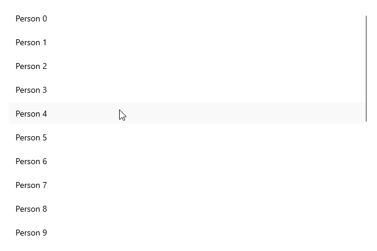

# .NET MAUI CollectionView LoadOnDemand Collection

To load items on demand, you can use the `CollectionView.LoadOnDemandCollection` and set it as an `ItemsSource` for the `CollectionView`.

The `LoadOnDemandCollection` is a generic type, so you need to point the type of objects it will contain. The type extends the `ObservableCollection<T>` class and expects a `Func<CancellationToken, IEnumerable>` in the constructor.

## Example

The following example demonstrates a simple setup that shows how to use the collection:

**1.** Create a sample model:

<snippet id='person-datamodel' />

**2.** Define the CollectionView control:

<snippet id='collectionview-loadondemand-collection' />

**3.** Add the `telerik` namespace:

```XAML
xmlns:telerik="http://schemas.telerik.com/2022/xaml/maui"
```

**4.** Create a `ViewModel` and use the `LoadOnDemandCollection` as a type of the property bound to the `RadCollectionView.ItemsSource`:

<snippet id='collectionview-loadondemand-collection-viewmodel' />

This is the result:



> For a runnable example demonstrating the CollectionView LoadOnDemand Collection, see the [SDKBrowser Demo Application]() and go to **CollectionView > Load On Demand** category.

## See Also

- [Load On Demand Command]()
- [Load On Demand Event]()
- [Customize the Load On Demand Manual and Automatic Loading Indicators]()
