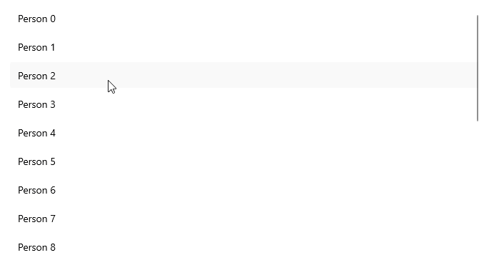

# .NET MAUI CollectionView LoadOnDemand Event

You can load items on demand by utilizing the `LoadOnDemand` event. The `LoadOnDemand` event handler receives two parameters:

* The `sender` argument, which is of type object, but can be cast to the `RadCollectionView` type.
* An `EventArgs` object.

## Example

The following example demonstrates a simple setup that shows how to use the event:

**1.** Create a sample model:

<snippet id='person-datamodel' />

**2.** Define the CollectionView control with a `Manual` `LoadOnDemandMode` for example:

<snippet id='collectionview-loadondemand-event' />

**3.** Add the `telerik` namespace:

```XAML
xmlns:telerik="http://schemas.telerik.com/2022/xaml/maui"
```

**4.** Define sample data to the `RadCollectionView.ItemsSource`:

<snippet id='collectionview-loadondemand-event-data' />

**5.** The `LoadOnDemand` event implementation:

<snippet id='collectionview-loadondemand-event-implementation' />

This is the result:



> For a runnable example demonstrating the CollectionView LoadOnDemand Event, see the [SDKBrowser Demo Application]() and go to **CollectionView > Load On Demand** category.

## See Also

- [Load On Demand Collection]()
- [Load On Demand Command]()
- [Customize the Load On Demand Manual and Automatic Loading Indicators]()