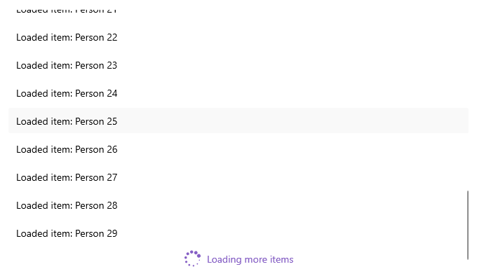
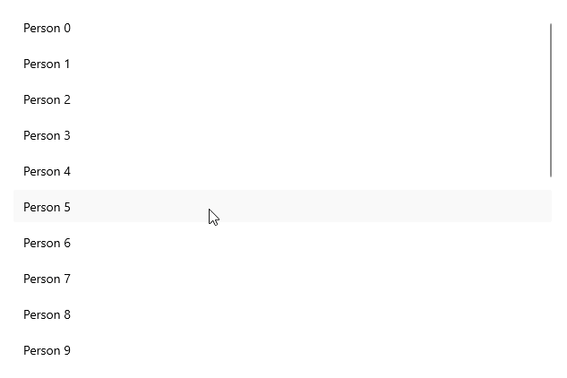

# .NET MAUI CollectionView LoadOnDemand Automatic and Manual Templates

You can customize the appearance of the automatic and manual elements by using the following templates:

* `AutomaticLoadOnDemandTemplate` (`DataTemplate`)&mdash;Specifies the template of the view visualized for `Automatic` loading.
* `ManualLoadOnDemandTemplate` (`DataTemplate`)&mdash;Specifies the template of the view visualized for `Manual` loading.

## Example with Automatic Template

Here is an example how to customize the automatic indicator:

**1.** Create a sample model:

<snippet id='person-datamodel' />

**2.** Define the CollectionView control and set the `AutomaticLoadOnDemandTemplate`:

<snippet id='collectionview-loadondemand-automatic-template' />

**3.** Define the `AutomaticLoadOnDemandTemplate` in the page's resources:

<snippet id='collectionview-loadondemand-automatic-template-resource' />

**4.** Add the `telerik` namespace:

```XAML
xmlns:telerik="http://schemas.telerik.com/2022/xaml/maui"
```

**5.** Create a `ViewModel` and use the `LoadOnDemandCollection` as a type of the property bound to the `RadCollectionView.ItemsSource`:

<snippet id='collectionview-loadondemand-collection-viewmodel' />

This is the result:



> For a runnable example demonstrating the CollectionView LoadOnDemand Automatic Template, see the [SDKBrowser Demo Application]() and go to **CollectionView > Load On Demand** category.

## Example with Manual Template

Here is an example how to customize the manual button:

**1.** Create a sample model:

<snippet id='person-datamodel' />

**2.** Define the CollectionView control and set the `ManualLoadOnDemandTemplate`:

<snippet id='collectionview-loadondemand-manual-template' />

**3.** Define the `ManualLoadOnDemandTemplate` in the page's resources:

<snippet id='collectionview-loadondemand-manual-template-resource' />

**4.** Add the `telerik` namespace:

```XAML
xmlns:telerik="http://schemas.telerik.com/2022/xaml/maui"
```

**5.** Create a `ViewModel` and use the `LoadOnDemandCollection` as a type of the property bound to the `RadCollectionView.ItemsSource`:

<snippet id='collectionview-loadondemand-collection-viewmodel' />

This is the result:



> For a runnable example demonstrating the CollectionView LoadOnDemand Manual Template, see the [SDKBrowser Demo Application]() and go to **CollectionView > Load On Demand** category.

## See Also

- [Load On Demand Collection]()
- [Load On Demand Command]()
- [Load On Demand Event]()