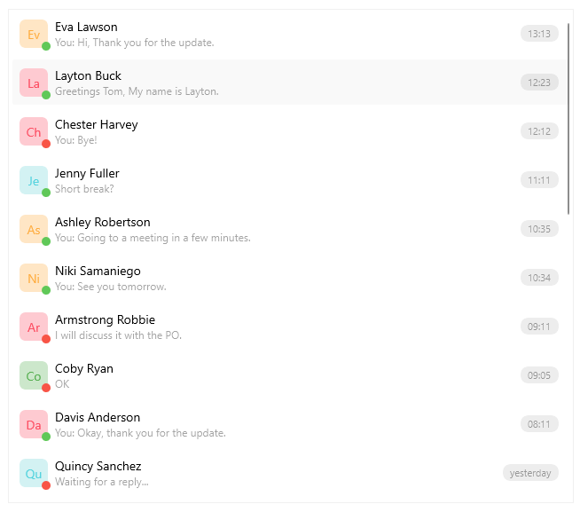

# .NET MAUI CollectionView Overview

The Telerik .NET MAUI CollectionView is a virtualizing view component that provides features associated with scenarios where a list of items is used. The control gives you the option to filter, sort and group the items. Also you can take advantage of the flexible styling API and the exposed templates for customization. 

## Key Features

* [Selection]()&mdash;The .NET MAUI CollectionView supports both single and multiple selections. It also allows you to select items by using the tap gesture.

* [Data Binding]()&mdash; The CollectionView for .NET MAUI component supports data binding in the form of a path property.

* [Item Appearance](#define-item-appearance)&mdash;CollectionView allows you to adjust the appearance of its items. You can also apply different appearances to each item based on a specific condition.

* Different layouts and orientation&mdash;You can choose between the [linear]() and [grid]() layouts. In addition, the CollectionView supports vertical and horizontal orientation for the exposed layouts. The orientation of the conrol allows you to scroll the items vertically or horizontally.

* [Grouping]()&mdash;You can group the items by using the exposed properties. In addition, you can apply multi-level (nested) grouping.

* [Group headers]()&mdash;While grouping the items in the CollectionView, group header is visualized. In addition, you can customize its appearance by using a template.

* [Sorting]()&mdash;CollectionView allows you to sort the data based on your criteria.

* [Filtering]()&mdash;You can filter the items in the CollectionView by using the exposed filter descriptors.

* [Events]()&mdash;The CollectionView exposes events that are invoked when scrolling, tapping on item or group item.

* [Programmatic scrolling]()&mdash;CollectionView provides an API that allows you to scroll to a specific item.

* [Style properties]()&mdash;The available styling properties allow you to customize the CollectionView items and groups. To take advantage of the conditional styling feature provided by the CollectionView, you can use the [style selector]().

* [Empty template]()&mdash;When the `ItemsSource` is null or the collection is empty, you can specify a template that provides user feedback.

* [Commands support]()&mdash;The CollectionView exposes commands that execute when tapping on an item or on a group header.

## Next Steps

- [Getting Started with Telerik UI for .NET MAUI CollectionView]()
- [Data Binding and Item appearance in the CollectionView]()

## See Also

- [.NET MAUI CollectionView Product Page](https://www.telerik.com/maui-ui/collectionview)
- [.NET MAUI CollectionView Forum Page](https://www.telerik.com/forums/maui?tagId=1829)
- [Telerik .NET MAUI Blogs](https://www.telerik.com/blogs/mobile-net-maui)
- [Telerik .NET MAUI Roadmap](https://www.telerik.com/support/whats-new/maui-ui/roadmap)