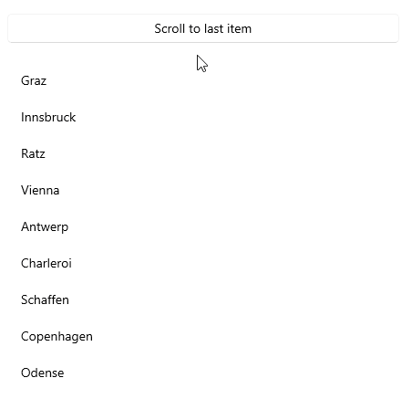

# .NET MAUI CollectionView Scrolling

The users can vertically and horizontally scroll through the item in the CollectionView and also scroll to an item from the collection. 

## Scrolling to an Item

The CollectionView provides the `ScrollItemIntoView` method that allows you to programmatically scroll to an item in the CollectionView:

* `ScrollItemIntoView`(`object item, bool animate = true`)&mdash;Scrolls the visible area of the control so that the specified item is visible. The first parameter is `item`&mdash;Specifies the item to scroll to. 

The second parameter is the scrolling animation. The animation is displayed when scrolling an item into view. Disable the animation by setting the animate argument of the `ScrollItemIntoView` method to `false`. The default value is `true`.

The following example demonstrates how to scroll to an item in the CollectionView control by using the `ScrollItemIntoView()` method.

**1.** Create a sample `DataModel`:

<snippet id='collectionview-datamodel' />

**2.** Define the `ViewModel` class:

<snippet id='collectionview-viewmodel' />

**3.** Define the `RadCollectionView` in XAML:

<snippet id='collectionview-programmatic-scrolling-xaml'/>

**4.** Add the `telerik` namespace:

```XAML
xmlns:telerik="http://schemas.telerik.com/2022/xaml/maui"
```

**5.** Button clicked event handler for calling the `ScrollTo` method:

<snippet id='collectionview-programmatic-scrolling'/>

This is the result on WinUI:



> For a runnable demo with the CollectionView Programmatic Scrolling example, see the [SDKBrowser Demo Application]() and go to the **CollectionView > Scrolling** category.

## Events

The CollectionView exposes a `Scrolled` event that is invoked when scrolling is performed. 

The CollectionView provides the `Scrolled` event, which is raised when scrolling is performed. The `Scrolled` event handler receives two parameters:

* The sender argument, which is the `RadCollectionView` control.
* A `ScrolledEventArgs` object, which provides the following properties:
	* `ScrollX` (`double`)&mdash;The X position of the finished scroll.
	* `ScrollY` (`double`)&mdash;The Y position of the finished scroll.

> For a runnable demo with the CollectionView Scrolled example, see the [SDKBrowser Demo Application]() and go to the **CollectionView > Events** category.

## See Also

- [Grouping]()
- [Filtering]()
- [Sorting]()
- [Selection]()
- [Commands]()
- [Events]()

