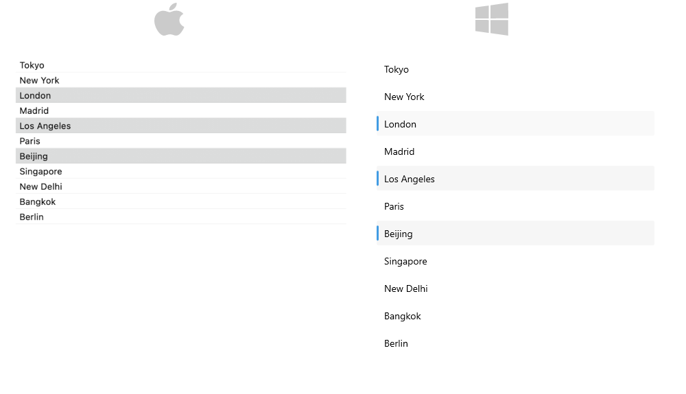
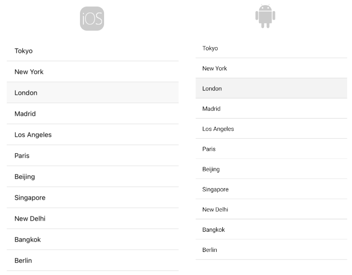

# .NET MAUI CollectionView Selection

The CollectionView for .NET MAUI exposes the Selection feature, which allows the user to select a single item or multiple items in the CollectionView. This feature provides both visual and programmatic feedback for the user's actions. If needed, you can disable the Selection.

## Selection Mode

The CollectionView provides three selection modes, which allow you to manipulate the selection type. This is controlled by the `SelectionMode` (`Telerik.Maui.Controls.CollectionView.CollectionViewSelectionMode`) property which has the following entries:

- `None`&mdash;The users cannot select an item.
- `Single` (default)&mdash;The users can select only one item.
- `Multiple`&mdash;The users can select more than one item.

Multple selection on desktop:



> For a runnable example demonstrating the CollectionView Multiple Selection and Disabled Selection, see the [SDKBrowser Demo Application]() and go to the **CollectionView > Selection** category.

## Selected Item

The CollectionView provides the `SelectedItem` (`object`) property, which specifies the first selected item of the CollectionView.

The following example demonstrates how to configure the CollectionView control for Single Selection by using the `SelectedItem` property.

**1.** Define the `RadCollectionView` in XAML:

<snippet id='collectionview-selecteditem'/>

**2.** Add the `telerik` namespace:

```XAML
xmlns:telerik="http://schemas.telerik.com/2022/xaml/maui"
```

**3.** Create a sample `DataModel`:

<snippet id='combobox-city-businessmodel' />

**4.** Define the `ViewModel` class:

<snippet id='collectionview-selection-viewmodel' />

> For a runnable example demonstrating the CollectionView `SelectedItem`, see the [SDKBrowser Demo Application]() and go to **CollectionView > Selection** category.

## Selected Index

The CollectionView provides the `SelectedIndex`(`int`) property. The `SelectedIndex` specifies the index of the first item in the current selection or `-1` if the selection is empty.

## Selected Items Collection

The CollectionView provides a read-only collection&mdash;`SelectedItems` of type `ObservableCollection<object>`. The collection contains the items that are currently selected in the control.

The following example demonstrates how to configure the CollectionView control for Multiple Selection by using the `SelectedItems` collection.

**1.** Define the `RadCollectionView` in XAML:

<snippet id='collectionview-multiple-selection'/>

**2.** Add the `telerik` namespaces:

```XAML
xmlns:telerik="http://schemas.telerik.com/2022/xaml/maui"
```

**3.** Create a sample `CityModel`:

<snippet id='combobox-city-businessmodel' />

**4.** Define the `ViewModel` class:

<snippet id='collectionview-selection-viewmodel' />

This is the result on mobile:



> For a runnable example demonstrating the CollectionView `SelectedItems`, see the [SDKBrowser Demo Application]() and go to **CollectionView > Selection** category.

## Selection Events

The CollectionView provides the `SelectionChanged` event, which is raised when the current selection changes. The `SelectionChanged` event handler receives two parameters:

* The sender argument, which is the `RadCollectionView` control.
* A `RadSelectionChangedEventArgs` object, which provides the following properties:
	* `RemovedItems` (`IEnumerable<object>`)&mdash;The deselected items.
	* `AddedItems` (`IEnumerable<object>`)&mdash;The selected items.

## See Also

- [Grouping]()
- [Filtering]()
- [Commands]()
