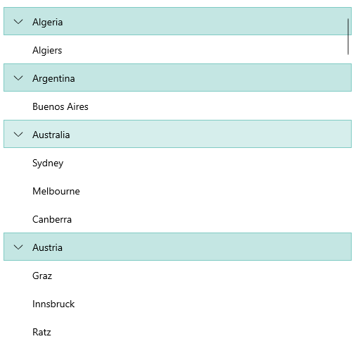

# .NET MAUI CollectionView Group Styling

To style the group header set the following properties:

* `GroupViewStyle` (`Style` with target type `RadCollectionViewGroupView`)&mdash;Specifies the style applied to the group header when grouping is applied.

The `GroupViewStyle` has a `ExpandCollapseIndicatorStyle` property that allows you to style the expand indicator. The `ExpandCollapseIndicatorStyle` (`Style` with target type `Label`).

The following example shows how to use the `GroupViewStyle`:

**1.** Define the following business object:

<snippet id='collectionview-datamodel' />

**2.** Create a `ViewModel` class as shown below:

<snippet id='collectionview-viewmodel' />

**3.** Add the `RadCollectionView` definition with the `GroupViewStyle` set:

<snippet id='collectionview-groupview-style' />

**4.** Include the `telerik` namespace:

```XAML
xmlns:telerik="http://schemas.telerik.com/2022/xaml/maui" 
```

**5.** Add the following style for the `GroupViewStyle` to the page's resource:

<snippet id='contentview-groupview-style-resources' />

**6.** Add the following style for the `ExpandCollapseIndicatorStyle` to the page's resource:

<snippet id='collectionview-group-expand-collapse-indicator-resources' />

This is the result on WinUI:



> For a runnable example demonstrating the CollectionView GroupView Styling, see the [SDKBrowser Demo Application]() and go to **CollectionView > Styling**.

## See Also

- [Grouping]()
- [Filtering]()
- [Sorting]()
- [Selection]()
- [Commands]()
- [Events]()
