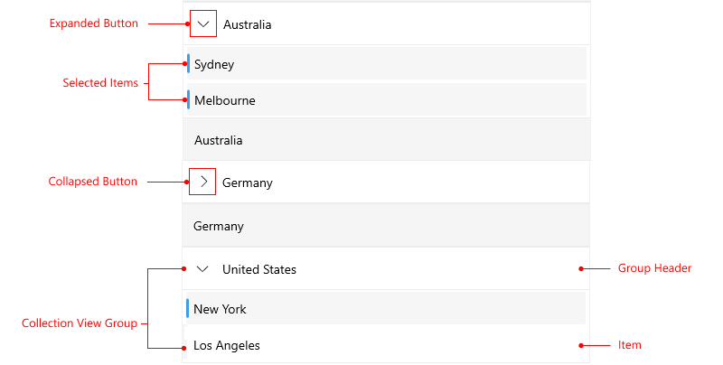

# .NET MAUI CollectionView Visual Structure

Here are described all visual elements used in the CollectionView for .NET MAUI.

## CollectionView Visual Structure

## Legend

- **Item**&mdash;Represents the item in the CollectionView.
- **Selection**&mdash;Represents the selection indication in the CollectionView.
- **Group with Items**&mdash;Represents the group (the header, the collapse/expand indicator, and the items) in the CollectionView.
- **Group View**&mdash;Represents the elements inside the group area&mdash;the group header and group expand or collapse indicator.
- **Group Expand/Collapse Indicator**&mdash;Represents the expand or collapse indicator which indicates whether the group is expanded or collapsed.
- **Group Header**&mdash;Represents the group header element.