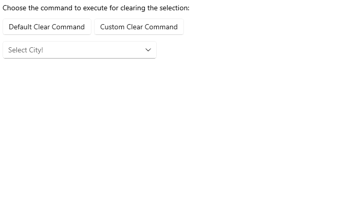

# .NET MAUI ComboBox Commands

ComboBox has the following commands:

- `SelectAllCommand` (`ICommand`)&mdash;Selects all items from the source.

> The `SelectAll` command can be used only when `SelectionMode` is `Multiple`. An exception will be thrown if the command is invoked in `Single` `SelectionMode`.

- `ClearSelectionCommand` (`ICommand`)&mdash;Sets the selection to null. If Multiple `SelectionMode` is used, this command will clear all selected items.

Here is an example with `ClearSelectionCommand`:

<snippet id='combobox-commands'/>

<snippet id='combobox-commands-csharp'/>

## See Also

- [Configuration]()
- [Data Binding]()
- [Edit Mode & Search]() 
- [Templates]()
