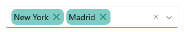
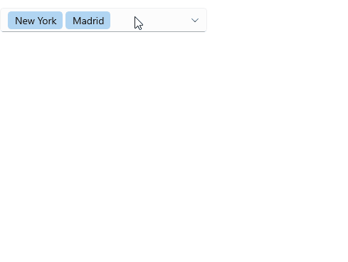

# .NET MAUI ComboBox Commands

The [.NET MAUI ComboBox]() provides commands that let you manipulate its selection.

## SelectAll Command

`SelectAllCommand` (`ICommand`)&mdash;Selects all items from the source.

To use the `SelectAll` command, set the selection mode to `Multiple`. If you invoke the command in `Single` selection mode, the ComboBox throws an exception.

## Clear Selection Command

`ClearSelectionCommand` (`ICommand`)&mdash;Sets the selection to null. If you use the `Multiple` selection mode, this command will clear all selected items. You can override the default behavior and create a custom command.

The example below shows both cases, the default `ClearSelectionCommand` execution and custom `ClearSelectionCommand` implementation:

<snippet id='combobox-commands'/>

<snippet id='combobox-commands-csharp'/>

## Remove Token Command

- `RemoveTokenCommand`(`ICommand`)&mdash;Removes a token from the ComboBox selection in `Multiple` selection mode. This command is called from the token's `DataTemplate` when the user taps the label for clearing the token.

### Example with the default RemoveTokenCommand

The example below shows how you can call the default `RemoveTokenCommand` from a custom `TokenTemplate` implementation:

<snippet id='combobox-default-removetoken' />

### Example with a custom RemoveTokenCommand

The example demonstrates a custom `RemoveTokenCommand` implementation - there is a confirmation dialog before the default command to be executed.

**1.** Create a custom command class that inherits from `ComboBoxRemoveTokenCommand` and override, for example, its `Execute` method:

<snippet id='combobox-custom-removetokencommand' />

**2.** Apply the newly created command class to the `RadComboBox`'s `RemoveTokenCommand`:

<snippet id='combobox-custom-removetoken' />

## See Also

- [Configuration]()
- [Data Binding]()
- [Edit Mode & Search]() 
- [Templates]()
