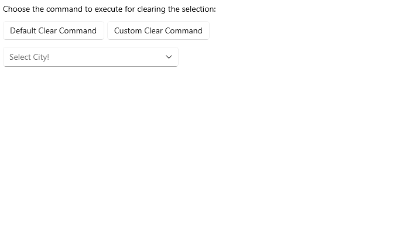
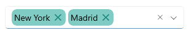
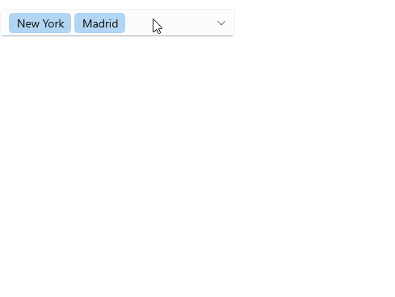
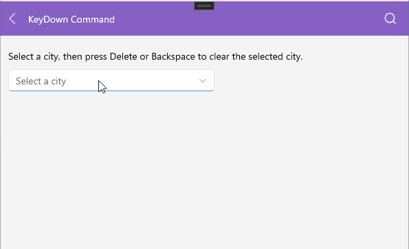

# .NET MAUI ComboBox Commands

The [.NET MAUI ComboBox]() provides commands that let you manipulate its selection.

## SelectAll Command

`SelectAllCommand` (`ICommand`)&mdash;Selects all items from the source.

To use the `SelectAll` command, set the selection mode to `Multiple`. If you invoke the command in `Single` selection mode, the ComboBox throws an exception.

## ClearSelection Command

`ClearSelectionCommand` (`ICommand`)&mdash;Sets the selection to null. If you use the `Multiple` selection mode, this command will clear all selected items. You can override the default behavior and create a custom command.

The example below shows both cases, the default `ClearSelectionCommand` execution and custom `ClearSelectionCommand` implementation:

<snippet id='combobox-commands'/>

<snippet id='combobox-commands-csharp'/>



## RemoveToken Command

- `RemoveTokenCommand`(`ICommand`)&mdash;Removes a token from the ComboBox selection in `Multiple` selection mode. This command is called from the token's `DataTemplate` when the user taps the label for clearing the token.

>caption Example with the default `RemoveTokenCommand`

The example below shows how you can call the default `RemoveTokenCommand` from a custom `TokenTemplate` implementation:

<snippet id='combobox-default-removetoken' />



>caption Example with a custom `RemoveTokenCommand`

The example demonstrates a custom `RemoveTokenCommand` implementation - there is a confirmation dialog before the default command to be executed.

1. Create a custom command class that inherits from `ComboBoxRemoveTokenCommand` and override, for example, its `Execute` method:

<snippet id='combobox-custom-removetokencommand' />

2. Apply the newly created command class to the `RadComboBox`'s `RemoveTokenCommand`:

<snippet id='combobox-custom-removetoken' />



## KeyDown Command Desktop

The ComboBox allows you to handle key press events through the `KeyDownCommand`(`ICommand`). This command is useful for implementing custom logic when a key is pressed. The parameter of the command is of type `Telerik.Maui.KeyboardInfo` and provides information about the key that is pressed.

The example below demonstrates a custom `KeyDownCommand` implementation:

1. Define a custom `KeyDownCommand` that inherits from `ComboBoxKeyDownCommand` and override its `Execute` method:

<snippet id='combobox-custom-keydowncommand' />

2. Apply the newly created command class to the `KeyDownCommand` of the ComboBox:

<snippet id='combobox-custom-keydown' />

3. Add the telerik namespace to the XAML page:

```XAML
xmlns:telerik="http://schemas.telerik.com/2022/xaml/maui"
```

4. Define sample data model:

<snippet id='combobox-city-businessmodel' />

5. Define the `ViewModel`:

<snippet id='combobox-cities-viewmodel' />

This is the result of the custom `KeyDownCommand` implementation:

 

## See Also

- [Configuration]()
- [Data Binding]()
- [Edit Mode & Search]() 
- [Templates]()
