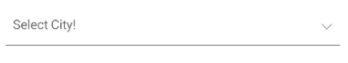
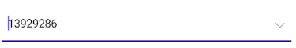

# Configure the .NET MAUI ComboBox

The purpose of this help article is to show the basic configuration options of the [.NET MAUI ComboBox]() control.

## Placeholder

* `Placeholder`(`string`): Sets the text which is used to give guidance to the end user on what can be entered/searched in the input. The watermark text is displayed when the input field is empty, or the selected item/s is/are cleared. 
* `PlaceholderColor`(`Color`): Defines the color for the watermark text. 

Here is an example of setting the `Placeholder` property:

<snippet id='combobox-configuration-placeholder'/>

The next image shows the result:

Here is an example of setting the `PlaceholderColor` property:

<snippet id='combobox-configuration-placeholder-color'/>

The next image shows the result:

## Text

* `Text`(`string`): Specifies the Text of the control. This is the Text that gets visualized when:
   * The control is editable.
   * The control is non-editable and the selection mode is single.

## Spell Checking

* `IsSpellCheckEnabled`(`bool`)&mdash;Specifies whether the spell checking of the ComboBox is enabled. By default, the `IsSpellCheckEnabled` value is `False`. When spell checking is enabled, misspellings are indicated in the ComboBox input.

The example below shows how to apply the `IsSpellCheckEnabled` property:

<snippet id='combobox-configuration-spellcheckenabled' />

## Clear Button Visibility

The visibility state of the Clear **X** button can be changed using the `IsClearButtonVisible`(`bool`) property. By default its value is true.

Here is an example with `IsClearButtonVisible` property set:

<snippet id='combobox-configuration-clearbuttonvisible-false'/>

and the result: 

> For the ComboBox Configuration example, refer to the [SDKBrowser Demo Application]() and navigate to the **ComboBox > Features** category.

## Drop-Down Behavior

To manage the drop-down of the ComboBox, use the following properties:

* `DropDownWidth` (`double`)&mdash;Defines the width of the drop-down.
* `DropDownHeight` (`double`)&mdash;Defines the height of the drop-down.
* `DropDownMaxHeight` (`double`)&mdash;Defines the max height of the drop-down. Always set the `DropDownMaxHeight`, so that you can have a predefined height for the drop-down. If using both the `DropDownMaxHeight` and `DropDownHeight` properties, the max height value must be higher.
* `DropDownVerticalOffset` (`double`)&mdash;Defines the vertical offset of the drop-down part of the control. This property allows an option to modify the control with no space between the ComboBox and the drop-down.
* `IsDropDownOpen` (`bool`)&mdash;Defines whether the drop-down part of the control is opened. The default value is `true`. 
* `IsDropdownClosedOnSelection` (`bool`)&mdash;Defines whether the drop-down will be closed when the item is selected or deselected. The default value is `true`.

Here is an example that uses the `DropDownWidth` property:

<snippet id='combobox-configuration-dropdownwidth'/>

Here is an example that uses the `DropDownHeight` property:

<snippet id='combobox-configuration-dropdownheight'/>

Here is an example that uses the `DropDownMaxHeight` property:

<snippet id='combobox-configuration-dropdownmaxheight'/>

Here is an example that uses the `DropDownVerticalOffset` property:

<snippet id='combobox-configuration-dropdownverticaloffset'/>

Here is an example with `IsDropdownClosedOnSelection` property set:

<snippet id='combobox-configuration-dropdownvisibility-isdropdownclosed'/>

* `OpenOnFocus`(`bool`):Defines whether the drop down can be opened when the control is focused. The default value is `true`. The property is applicable for Editable ComboBox.

Here is an example with `OpenOnFocus` property set:

<snippet id='combobox-configuration-dropdownvisibility-openonfocus'/>

>tip Review the [Adding Select All Option in ComboBox Drop-Down]() article for more details how to select all items from the drop-down list.

## Keyboard

The `Keyboard` property of type `Microsoft.Maui.Keyboard` allows you to define the type of the keyboard that will be visualized by the device. The default value is Text.

> For the ComboBox Drop-Down Configuration example, refer to the [SDKBrowser Demo Application]() and navigate to the **ComboBox > Features** category.

## See Also

- [Data Binding]() 
- [Edit Mode & Search]() 
- [Selection]() 
