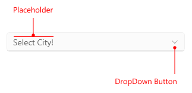

# Configure the .NET MAUI ComboBox

The purpose of this help article is to show the basic configuration options of the ComboBox control.

## Placeholder

* `Placeholder`(`string`): Sets thehe text which is used to give guidance to the end user on what should be entered/searched in the input. The watermark text is displayed when the input field is empty, or the selected item/s is/are cleared. 
* `PlaceholderColor`(`Color`): Defines the color for the watermark text. 

Here is an example of setting the `Placeholder` property:

<snippet id='combobox-configuration-placeholder'/>

and the result:

## Text

* `Text`(`string`): Specifies the Text of the control. This is the Text that gets visualized when the control is editable or when it is non-editable and the selection mode is single.

## ClearButton Visibility

The visibility state of the Clear **X** button can be changed using the `IsClearButtonVisible`(`bool`) property. By default its value is true.

Here is an example with `IsClearButtonVisible` property set:

<snippet id='combobox-configuration-clearbuttonvisible-false'/>

and the result: 

## DropDown Behavior

ComboBox provides the following properties for managing the drop down:

* `DropDownWidth`(`double`)&mdash;Defines the width of the dropdown of the control.
* `DropDownHeight`(`double`)&mdash;Defines the height of the dropdown of the control.
* `IsDropDownOpen`(`bool`)&mdash;Defines whether the drop down part of the control is opened. Default value is `true`. 
* `IsDropdownClosedOnSelection`(`bool`)&mdash;Defines whether the drop down should be closed when item is selected/deselected. The default value is `true`.

Here is an example with `IsDropdownClosedOnSelection` property set:

<snippet id='combobox-configuration-dropdownvisibility-isdropdownclosed'/>

* `OpenOnFocus`(`bool`):Defines whether the drop down should be opened when the control is focused. The default value is `true`. It is only applicable for Editable ComboBox.

Here is an example with `OpenOnFocus` property set:

<snippet id='combobox-configuration-dropdownvisibility-openonfocus'/>

## Keyboard

The `Keyboard` property of type `Microsoft.Maui.Keyboard` allows you to define the type of the keyboard that will be visualized by the device. The default value is Text.

>important The Configuration example can be found in our [SDK Browser Application](). You can find the application in the **Examples** folder of your local **Telerik UI for .NET MAUI** installation or in the following [GitHub repo](https://github.com/telerik/maui-samples/tree/main/Samples/SdkBrowser).

## See Also

- [Data Binding]() 
- [Edit Mode & Search]() 
- [Selection]() 
