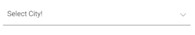
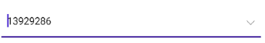

# Configure the .NET MAUI ComboBox

Use this article to configure the most common [.NET MAUI ComboBox]() behaviors, including placeholder text, text input, spell checking, the clear button, drop-down behavior, keyboard type, and theme-aware placeholder color.

## What Can You Configure in the ComboBox

Use the following areas depending on the behavior you want to change:

| Area | Main Properties | Use It When |
|---|---|---|
| Placeholder | `Placeholder`, `PlaceholderColor` | You want to guide the user before a value is selected or entered. |
| Text input | `Text`, `IsSpellCheckEnabled`, `Keyboard` | You want to control what the user types and how the input behaves. |
| Clear action | `IsClearButtonVisible` | You want to show or hide the clear button. |
| Drop-down behavior | `DropDownWidth`, `DropDownHeight`, `DropDownMaxHeight`, `DropDownVerticalOffset`, `IsDropDownOpen`, `IsDropdownClosedOnSelection`, `OpenOnFocus` | You want to control how the drop-down opens, closes, and appears. |

## Placeholder

Use the placeholder properties when you want to guide the user before input or selection:

- `Placeholder` (`string`)&mdash;Sets the guidance text shown when the input is empty or when the selected item or items are cleared.
- `PlaceholderColor` (`Color`)&mdash;Defines the color of the placeholder text.

The following example sets the `Placeholder` property:

<snippet id='combobox-configuration-placeholder'/>

The following image shows the result:

The following example sets the `PlaceholderColor` property:

<snippet id='combobox-configuration-placeholder-color'/>

The following image shows the result:

## Text

Use the `Text` property of type `string` when you want to set or read the visible text of the control. This text appears when:

- The ComboBox is editable.
- The ComboBox is non-editable and the selection mode is single.

## Spell Checking

Use `IsSpellCheckEnabled` (`bool`) to control whether spell checking is enabled in the ComboBox input. The default value is `False`. When spell checking is enabled, misspellings are indicated in the input field.

The following example applies `IsSpellCheckEnabled`:

<snippet id='combobox-configuration-spellcheckenabled' />

## Clear Button Visibility

Use `IsClearButtonVisible` (`bool`) to show or hide the clear **X** button. The default value is `True`.

The following example sets `IsClearButtonVisible`:

<snippet id='combobox-configuration-clearbuttonvisible-false'/>

The following image shows the result:

>note
> For a complete ComboBox configuration example, see the [SDKBrowser App]() and navigate to **ComboBox** > **Features**.

## Drop-Down Behavior

Use the following properties to control how the drop-down opens, closes, and appears:

* `DropDownWidth` (`double`)&mdash;Defines the width of the drop-down.
* `DropDownHeight` (`double`)&mdash;Defines the height of the drop-down.
* `DropDownMaxHeight` (`double`)&mdash;Defines the max height of the drop-down. Always set the `DropDownMaxHeight`, so that you can have a predefined height for the drop-down. If using both the `DropDownMaxHeight` and `DropDownHeight` properties, the max height value must be higher.
* `DropDownVerticalOffset` (`double`)&mdash;Defines the vertical offset of the drop-down part of the control. This property allows an option to modify the control with no space between the ComboBox and the drop-down.
* `IsDropDownOpen` (`bool`)&mdash;Defines whether the drop-down part of the control is opened. The default value is `true`. 
* `IsDropDownClosedOnSelection` (`bool`)&mdash;Defines whether the drop-down will be closed when the item is selected or deselected. The default value is `true`.

The following example sets `DropDownWidth`:

<snippet id='combobox-configuration-dropdownwidth'/>

The following example sets `DropDownHeight`:

<snippet id='combobox-configuration-dropdownheight'/>

The following example sets `DropDownMaxHeight`:

<snippet id='combobox-configuration-dropdownmaxheight'/>

The following example sets `DropDownVerticalOffset`:

<snippet id='combobox-configuration-dropdownverticaloffset'/>

The following example sets `IsDropDownClosedOnSelection`:

<snippet id='combobox-configuration-dropdownvisibility-isdropdownclosed'/>

The following example sets `OpenOnFocus`:

<snippet id='combobox-configuration-dropdownvisibility-openonfocus'/>

>tip
> See [Add a Select All option in the ComboBox drop-down]() if you want to let users select all items from the drop-down list.

## Keyboard

Use the `Keyboard` (`Microsoft.Maui.Keyboard`)property to define which on-screen keyboard the device shows. The default value is `Text`.

>note
> For a ComboBox drop-down configuration example, see the [SDKBrowser App]() and navigate to **ComboBox** > **Features**.

## See Also

- [Data Binding]() 
- [Edit Mode & Search]() 
- [Selection]() 
