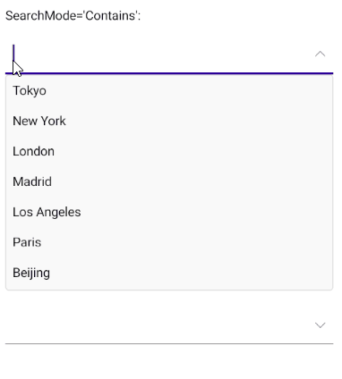

# .NET MAUI ComboBox Edit Mode & Search

The [Telerik UI for .NET MAUI ComboBox]() supports both `editable` and `non editable` state. When the control is in edit mode, users can type into the input field and searching through the control's ItemsSource can be performed. 

This topic describes in details the configuration options related to the editable state of the ComboBox as well as its searching capabilities.

## Edit Mode

* `IsEditable`(`bool`)&mdash;Defines whether typing into the input area can be performed. The default value is `false`.
* `SearchTextPath`(`string`)&mdash;Defines the name of the property against which the searching will be performed. The property is usable when the control is in edit mode (`IsEditable` is `true`). 
* `OpenOnFocus`(`bool`)&mdash;Specifies whether the drop-down will show as soon as the control is focused. The property is usable when the control is in edit mode (`IsEditable` is `true`).  The default value is `true`. If the property is `false` when the control is focused the drop-down will no longer open.
* `Text`(`string`)&mdash;Specifies the Text of the control. This is the Text that gets visualized when the control is editable or when its non-editable and the selection mode is single.

## Search

ComboBox provides both case-sensitive and case-insensitive searching modes. The following properties are exposed:

- `SearchMode`(enumeration of type `Telerik.Maui.Controls.SearchMode`)&mdash;Defines the value that sets search sets some search criteria for the control. The available options are: `Contains`, `StartsWith`, `ContainsCaseSensitive` and `StartsWithCaseSensitive`. The default SearchMode is `StartsWith`.
- `SearchTexhPath`(`string`)&mdash;Specifies the name of the property against which the searching will be performed.
* `HighlightTextColor`(*Microsoft.Maui.Graphics.Color*)&mdash;Defines the color of the text that will be highlighted when searching is performed.

> Searching can be performed when `IsEditable` is `true`.
> The ComboBox `DisplayMemberPath` property must be set when binding to complex objects. Also, when `IsEditable` is `true`, the `SearchTextPath` property must be set.

If you want the text to be highlighted when using a custom `ItemTemplate`, you have to add a `RadHighlightLabel` inside the `ItemTemplate`.

Here is the XAML definition of the ComboBox with `RadHighlightLabel` inside the `ItemTemplate`:

```XAML
<telerik:RadComboBox x:Name="comboBox"
                     ItemsSource="{Binding Items}" 
                     DisplayMemberPath="Name"
                     Placeholder="Select City"
                     AutomationId="comboBox"
                     HighlightTextColor="Red"
                     IsEditable="True">
    <telerik:RadComboBox.ItemTemplate>
        <DataTemplate>
            <telerik:RadBorder BackgroundColor="LightYellow"
                MinimumWidthRequest="300">

                <telerik:RadHighlightLabel TextColor="Black" Padding="10"
                                           HighlightTextColor="BlueViolet"
                                           UnformattedText="{Binding Name}"
                                           HighlightText="{Binding Source={x:Reference comboBox}, Path=Text}" />
            </telerik:RadBorder>
        </DataTemplate>
    </telerik:RadComboBox.ItemTemplate>
    <telerik:RadComboBox.SelectedItemTemplate>
        <DataTemplate>
            <telerik:RadBorder BackgroundColor="LightBlue"
                MinimumWidthRequest="300">
                <VerticalStackLayout>
                    <Label Text="{Binding Name}"
                           Padding="8, 7, 0, 7"
                           TextColor="Black"/>
                    <Label Text="{Binding Population}" 
                           FontSize="12"
                           Padding="8, 7, 0, 7"/>
                </VerticalStackLayout>
            </telerik:RadBorder>
        </DataTemplate>
    </telerik:RadComboBox.SelectedItemTemplate>
</telerik:RadComboBox>
```

> For a runnable demo with the ComboBox Search eamples with different scenarios, see the [SDKBrowser Demo Application]() and go to the **ComboBox > Features** category.



## See Also

- [Configuration]()
- [Single and Multiple Selection]()
- [Templates]()
