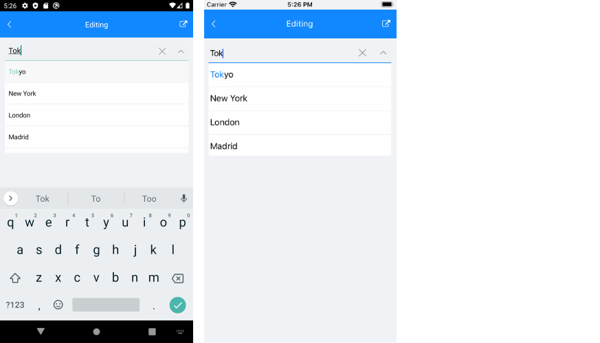

# Edit Mode & Search

ComboBox supports both **editable** and **noneditable** state. When the control is in edit mode, users can type into the input field and searching through the control's ItemsSource can be performed. 

This topic describes in details the configuration options related to the editable state of the ComboBox as well as its searching capabilities.

## Edit Mode

* `IsEditable`(`bool`): Defines whether typing into the input area can be performed. The default value is `false`.
* `SearchTextPath`(`string`): Defines the name of the property against which the searching will be performed. The property is usable when the control is in edit mode (`IsEditable` is `true`). 
* `OpenOnFocus`(`bool`): Specifies whether the dropdown will be shown as soon as the control is focused. The property is usable when the control is in edit mode (`IsEditable` is `true`).  The default value is `true`. If the property is set to false when the control is focused the drop-down will no longer open.
* `Text`(`string`): Specifies the Text of the control. This is the Text that gets visualized when the control is editable or when it is non-editable and the selection mode is single.

## Search

ComboBox provides both case-sensitive and case-insensitive searching modes. The following properties are exposed:

- **SearchMode** (enumeration of type *Telerik.XamarinForms.Input.SearchMode*): Defines the value that sets search sets some search criteria for the control. The available options are: `Contains`, `StartsWith`, `ContainsCaseSensitive` and `StartsWithCaseSensitive`. The default SearchMode is `StartsWith`.
- **SearchTexhPath**(*string*): Specifies the name of the property against which the searching will be performed.
* **HighlightTextColor** (*Xamarin.Forms.Color*): Defines the color of the text that will be highlighted when searching is performed.

> Searching can be performed when `IsEditable` is set to `true`.

## Example

Here is the ComboBox definition in XAML:

<snippet id='combobox-editing'/>

>note When binding to a complex objects, ComboBox **DisplayMemberPath** property should be set. Also when `IsEditable` is `true` `SearchTextPath` property should be set.

In addition to this, you need to add the following namespace:

 ```XAML
xmlns:telerik="http://schemas.telerik.com/2022/xaml/maui"
 ```

the sample business model

<snippet id='combobox-city-businessmodel'/>

and the ViewModel used:

<snippet id='combobox-cities-viewmodel'/>

Here is how the control looks in edit mode:



## See Also

- [Configuration]()
- [Single and Multiple Selection]()
- [Templates]()
