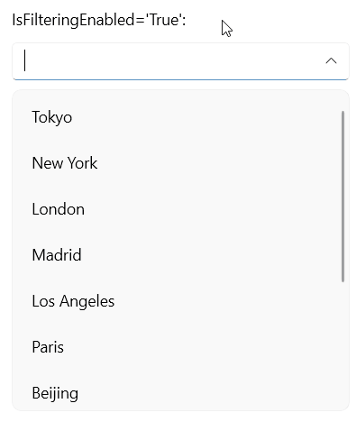
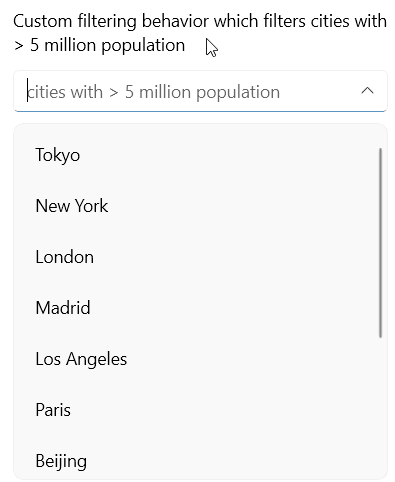

# .NET MAUI ComboBox Filtering

The [Telerik UI for .NET MAUI ComboBox]() provides filtering, which allows the users to refine their search results as they type into the input field. The default filtering is performed according to the `SearchMode` and `SearchTexhPath` properties of the ComboBox. 

For more details on the search functionality of the ComboBox, go to [Edit Mode & Search]() topic.

This topic describes in details the configuration options related to the filtering feature the ComboBox:

* `IsFilteringEnabled`(`bool`)&mdash;Indicates whether the filtering is enabled. Its default value is `False`.
* `FilteredItems`(`IReadOnlyCollection&lt;object&gt;`)&mdash;Gets the filtered items collection.
* `NoResultsMessage`(`string`)&mdash;Defines the message visualized when there are no matched items found during filtering.
* `NoResultsTemplate`(`DataTemplate`)&mdash;Defines the `DataTemplate` visualized when there are no matched items found during filtering.

Here is a quick example of `RadComboBox` with enabled filtering:

**1.** First, add the ComboBox definition with `IsEditable`, `IsFilteringEnabled` and `SearchMode` applied:

<snippet id='combobox-filtering' />

**2.** Add the `ViewModel` class:

<snippet id='combobox-cities-viewmodel' />

**3.** Add the `City` data item:

<snippet id='combobox-city-businessmodel' />

Here is the result:

## Custom Filtering Behavior

You can override the default logic for filtering items by applying a custom filtering behavior to the ComboBox. In this case the built-in search is performed upon the filtered items. Create a custom class that inherits from `ComboBoxFilteringBehavior` and override its `FilterItems` method, then assign it to the `ComboBox`'s `FilteringBehavior` property.

* `FilteringBehavior`(`ComboBoxFilteringBehavior`)&mdash;Defines the filtering behavior used to filter items.

Here is a quick example which demonstrates a custom filtering behavior - the items are filtered not only by the entered search text, but also according to the `Population` property. 

**1.** Create a custom filtering behavior class:

<snippet id='combobox-filtering-customfilterbehavior' />

**2.** Assign it to the ComboBox instance:

<snippet id='combobox-custom-filtering' />

For the purpose of the example, use the same `ViewModel` and `City` data item as in the previous filtering example.

Here is the result after applying the custom filtering behavior:

## See Also

- [Edit Mode & Search]()
- [Configuration]()
- [Single and Multiple Selection]()
