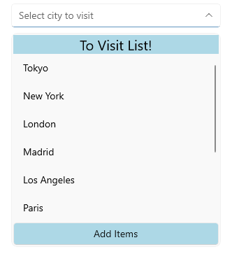

# Header and Footer in .NET MAUI ComboBox

You can add Header and Footer to the DropDown list of the ComboBox control through the following properties:

* `HeaderTemplate`(`DataTemplate`)&mdash;Defines the template of the header that will be visualized in the drop down list.
* `FooterTemplate`(`DataTemplate`)&mdash;Defines the template of the footer that will be visualized in the drop down list.

> It's not recommended to add controls in the Header and Footer which steal the focus (like Entry, editor, etc.) from the ComboBox control, as unexpected behavior may occur. 

## Example 

Here is the ComboBox definition in XAML:

<snippet id='combobox-header-footer-template'/>

the sample business model

<snippet id='combobox-city-businessmodel'/>

and the ViewModel used:

<snippet id='combobox-cities-viewmodel'/>

This is how the Header and Footer Templates look: 

> For the ComboBox Header and Footer example, go to the [SDKBrowser Demo Application]() and navigate to ComboBox -> Templates category.

## See Also

- [Configuration]()
- [Header and Footer]()
- [Edit Mode & Search]() 
- [Single and Multiple Selection]()
- [Styling]()
