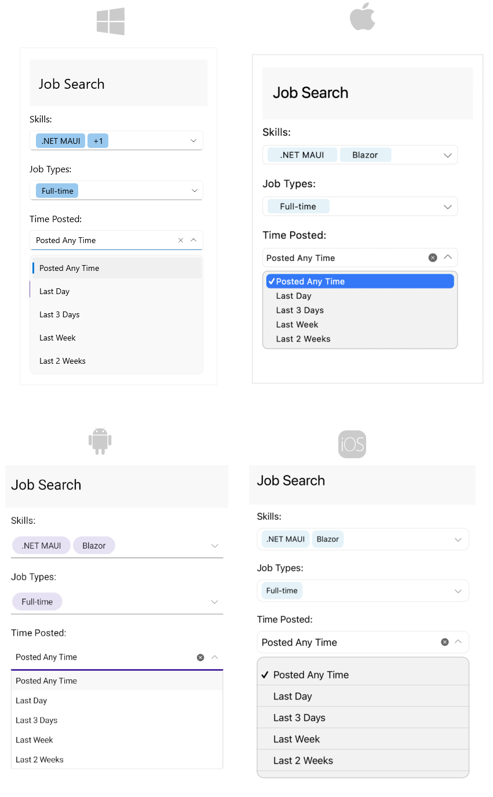

# .NET MAUI ComboBox Overview

The Telerik UI for .NET MAUI ComboBox enables users to select one or more items from a dropdown list. It offers various features, including search functionality, options for single and multiple selections, a flexible styling API, and customizable dropdowns, among others.

Use the ComboBox when you want users to choose from a predefined list and optionally search, filter, or select multiple values in the same input area.

## Key Features of the .NET MAUI ComboBox

* [Editable and non-editable modes]()&mdash;The ComboBox supports both editable and non-editable states. When the control is editable, users can type and search.
* [Searching support]()&mdash;The ComboBox supports `Contains`, `StartsWith`, `ContainsCaseSensitive`, and `StartsWithCaseSensitive` search modes.
* [Single and multiple selection]()&mdash;Use the `SelectionMode` property to let users select one item or multiple items.
* [Complex object binding]()&mdash;Use `DisplayMemberPath` to specify which property from a business object is displayed in the control.
* [Filtering support]()&mdash;Users can refine the visible results while they type in the input field.
* [Search highlighting]()&mdash;The ComboBox highlights the matching text in the dropdown after searching.
* [Placeholder support](#placeholder)&mdash;Show guidance text when the input is empty or the selected item is cleared.
* [Header and footer templates]()&mdash;Add custom content above and below the dropdown list through `HeaderTemplate` and `FooterTemplate`.
* [Clear button visibility](#clearbutton-visibility)&mdash;Control whether users can clear the selection through the built-in clear button.
* [Customizable dropdown](#dropdown-behavior)&mdash;Control the dropdown width, height, open state, and close-on-selection behavior.
* [Keyboard type](#keyboard)&mdash;Choose the mobile keyboard layout through the `Keyboard` property.
* [Keyboard navigation]()&mdash;Navigate, open, and close the dropdown with the keyboard on WinUI and MacCatalyst.
* UI virtualization support&mdash;Display large item collections efficiently because the control reuses existing visual items while the dropdown is scrolled.
* [Templates]()&mdash;Customize `ItemTemplate`, `SelectedItemTemplate`, `TokenTemplate`, and `ShowMoreTemplate`.
* [Command support]()&mdash;Use `ClearSelectionCommand` and `SelectAllCommand` from external UI.
* [Flexible styling API]()&mdash;Customize colors, borders, buttons, dropdown appearance, and text presentation.

## Theme-Aware Styling and AppThemeBinding

If you are looking for app theme binding support, use the ComboBox styling properties together with the standard .NET MAUI `AppThemeBinding` markup extension or with Telerik theme resources.

For example, you can apply theme-aware values to properties such as `BackgroundColor`, `BorderColor`, `TextColor`, `PlaceholderColor`, and dropdown styling properties. For control-specific styling options, see [Styling](). For app-wide theme resources and runtime theme switching, see [Theming Overview]().

Use the ComboBox styling article when you want to style only this control. Use the theming article when you want the ComboBox appearance to follow your app theme together with other Telerik controls.

## Next Steps

- [Getting Started with Telerik UI for .NET MAUI ComboBox]()
- [Style the ComboBox]()
- [Apply Telerik Themes Across the App]()

## See Also

- [Visual Structure]()
- [Getting Started]()
- [Configuration]()
- [Data Binding]()
- [Edit Mode & Search]() 
- [Single and Multiple Selection]()
- [Header and Footer]()
- [Templates]()
- [Styling]()
- [Theming Overview]()
- [.NET MAUI ComboBox Product Page](https://www.telerik.com/maui-ui/combobox)
- [.NET MAUI ComboBox Forum Page](https://www.telerik.com/forums/maui?tagId=1937)
- [Telerik .NET MAUI Blogs](https://www.telerik.com/blogs/mobile-net-maui)
- [Telerik .NET MAUI Roadmap](https://www.telerik.com/support/whats-new/maui-ui/roadmap)
