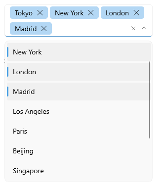

# .NET MAUI ComboBox Selection

ComboBox for .NET MAUI enables the app users to quickly and easily select item/items from the dropdown list. This topic will go through the provided by the ComboBox API related to item/items selection.

ComboBox control has a support for single and multiple selection. You can easily specify the required selection using the `SelectionMode` property.

## Main Properties

* `SelectionMode`(enumeration of type `Telerik.Maui.Controls.ComboBoxSelectionMode`)&mdash;Defines whether the selection is single or multiple.
* `SelectedIndex`(`int`)&mdash;Specifies the index of the first item in the current selection or -1 if the selection is empty.
* `SelectedItem`(`object`)&mdash;Defines the first item in the current selection, or null if the selection is empty.
* `SelectedItems`(`readonly ObservableCollection &lt;object &gt;`)&mdash;Gets the collection of currently Selected Items. 

> `SelectedItems` collection can be changed only when `SelectionMode` is `Multiple`. For `Single` `SelectionMode` use `SelectedItem`.

## Single Selection

The default `SelectinMode`(enumeration of type `Telerik.Maui.Controls.ComboBoxSelectionMode`) of the ComboBox control is `Single`.

### Example with Single Selection and SelectedIndex set

Here is the ComboBox definition in XAML:

<snippet id='combobox-single-selection-selectedindex'/>

you need to add the following namespace:

 ```XAML
xmlns:telerik="http://schemas.telerik.com/2022/xaml/maui"
 ```

the sample business model

<snippet id='combobox-city-businessmodel'/>

and the ViewModel used:

<snippet id='combobox-cities-viewmodel'/>

This is how single selection looks:


### Example with Single Selection and SelectedItem set

Here is the ComboBox definition in XAML:

<snippet id='combobox-single-selection-selecteditem'/>


the sample business model

<snippet id='combobox-city-businessmodel'/>

and the ViewModel used:

```C#
 public class ViewModel : NotifyPropertyChangedBase
{
    private int selectedIndex;
    private City selectedItem;
    private ObservableCollection<object> selectedItems;
    public ViewModel()
    {
        this.Items = new ObservableCollection<City>
        {
            new City { Name = "Tokyo", Population = 13929286 },
            new City { Name = "New York", Population = 8623000 },
            new City { Name = "London", Population = 8908081 },
            new City { Name = "Madrid", Population = 3223334 },
            new City { Name = "Los Angeles", Population = 4000000},
            new City { Name = "Paris", Population = 2141000 },
            new City { Name = "Beijing", Population = 21540000 },
            new City { Name = "Singapore", Population = 5612000 },
            new City { Name = "New Delhi", Population = 18980000 },
            new City { Name = "Bangkok", Population = 8305218 },
            new City { Name = "Berlin", Population = 3748000 },
        };

        this.SelectedIndex = 1;
        this.SelectedItem = this.Items[2];
    }

    public ObservableCollection<City> Items { get; set; }

    public ObservableCollection<object> SelectedItems
    {
        get
        {
            return this.selectedItems;
        }
        set
        {
            if (this.selectedItems != value)
            {
                this.selectedItems = value;

                this.selectedItems.Add(this.Items[0]);
                this.selectedItems.Add(this.Items[1]);

                this.OnPropertyChanged();
            }
        }
    }

    public int SelectedIndex
    {
        get
        {
            return this.selectedIndex;
        }
        set
        {
            if (this.selectedIndex != value)
            {
                this.selectedIndex = value;
                OnPropertyChanged();
            }
        }
    }

    public City SelectedItem
    {
        get
        {
            return this.selectedItem;
        }
        set
        {
            if (this.selectedItem != value)
            {
                this.selectedItem = value;
                OnPropertyChanged();
            }
        }
    }
}
```

## Multiple Selection

If you want to achieve multiple selection you will need to set the `SelectionMode` to `Multiple`. The multiple selected items are visualized inside tokens.

>important As the SelectedItems collection is read-only, in order to be notified when the collection is changed, you should listen to the  `CollectionChanged` event of the `SelectedItems`.

### Example with Multiple Selection and SelectedItems set

Here is the ComboBox definition in XAML:

<snippet id='combobox-multiple-selection'/>

the sample business model

<snippet id='combobox-city-businessmodel'/>

and the ViewModel used:

```C#
 public class ViewModel : NotifyPropertyChangedBase
{
    private int selectedIndex;
    private City selectedItem;
    private ObservableCollection<object> selectedItems;
    public ViewModel()
    {
        this.Items = new ObservableCollection<City>
        {
            new City { Name = "Tokyo", Population = 13929286 },
            new City { Name = "New York", Population = 8623000 },
            new City { Name = "London", Population = 8908081 },
            new City { Name = "Madrid", Population = 3223334 },
            new City { Name = "Los Angeles", Population = 4000000},
            new City { Name = "Paris", Population = 2141000 },
            new City { Name = "Beijing", Population = 21540000 },
            new City { Name = "Singapore", Population = 5612000 },
            new City { Name = "New Delhi", Population = 18980000 },
            new City { Name = "Bangkok", Population = 8305218 },
            new City { Name = "Berlin", Population = 3748000 },
        };

        this.SelectedIndex = 1;
        this.SelectedItem = this.Items[2];
    }

    public ObservableCollection<City> Items { get; set; }

    public ObservableCollection<object> SelectedItems
    {
        get
        {
            return this.selectedItems;
        }
        set
        {
            if (this.selectedItems != value)
            {
                this.selectedItems = value;

                this.selectedItems.Add(this.Items[0]);
                this.selectedItems.Add(this.Items[1]);

                this.OnPropertyChanged();
            }
        }
    }

    public int SelectedIndex
    {
        get
        {
            return this.selectedIndex;
        }
        set
        {
            if (this.selectedIndex != value)
            {
                this.selectedIndex = value;
                OnPropertyChanged();
            }
        }
    }

    public City SelectedItem
    {
        get
        {
            return this.selectedItem;
        }
        set
        {
            if (this.selectedItem != value)
            {
                this.selectedItem = value;
                OnPropertyChanged();
            }
        }
    }
}
```

This is how multiple selection looks: 



>important The Selection example can be found in our [SDK Browser Application](). You can find the applications in the **Examples** folder of your local **Telerik UI for .NET MAUI** installation or in the following [GitHub repo](https://github.com/telerik/maui-samples/tree/main/Samples/SdkBrowser).

## Events

ComboBox exposes a `SelectionChanged` event which is raised when item is selected.

The `SelectionChanged` event handler receives two parameters:

- The `sender` which is the RadComboBox control.
- ComboBoxSelectionChangedEventArgs provides the following properties:
	- `AddedItems`: the items added to the SelectedItemsCollection
	- `RemovedItems`: the items removed from the SelectedItmesCollection

## Commands

ComboBox has two commands related to the Selection feature:

- `SelectAllCommand`(`ICommand`)&mdash;Selects all items from the source.
- `ClearSelectionCommand`(`ICommand`)&mdash;Sets the selection to null. If Multiple SelectionMode is used, this command will clear all selected items.

## See Also

- [Configuration]()
- [Data Binding]()
- [Edit Mode & Search]() 
- [Templates]()
