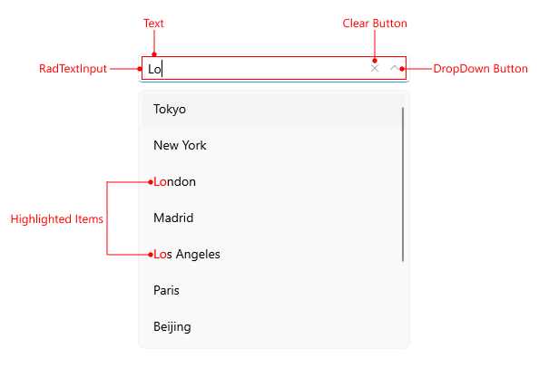

# .NET MAUI ComboBox Visual Structure

Here are described all visual elements used in the [.NET MAUI ComboBox]().

## ComboBox Visual Structure

- `Placeholder`&mdash;The text which is used to give guidance to the end user on what can be entered/searched in the input.
- `DropDown Button`&mdash;A button used for opening and closing the DropDown part of the control – the arrow icon of the button indicates whether it's currently opened or closed.
.

## Single Selection Structure

- `Text`&mdash;The text written in the control's input filed.
- `Clear Button`&mdash;Clears the selection of the control both multiple and single.
- `DropDown Button`&mdash;A button used for opening and closing the DropDown part of the control – the arrow icon of the button indicates whether it's currently opened or closed.
- `Selected Item`&mdash;The currently selected item.

## Tokens Structure

- `Tokens`&mdash;When multiple items are selected from the dropdown list, these items appear as tokens. They can be deselected using their close button.
- `ShowMore Template`&mdash;Represents an UI when the control is not focused and the space is not enough to show all tokens in a multiple selection scenario.

## Multiple Selection Structure

- `Tokens`&mdash;When multiple items are selected from the dropdown list, these items appear as tokens. They can be deselected using their close button.
- `SelectedItems`&mdash;The selected items, when multiple selection is used.
- `ShowMore Template`&mdash;Represents an UI when the control is not focused and the space is not enough to show all tokens in a multiple selection scenario.

## Edit Mode Structure

- `Clear Button`&mdash;Clears the selection of the control both multiple and single.
- `DropDown Button`&mdash;A button used for opening and closing the DropDown part of the control – the arrow icon of the button indicates whether it's currently opened or closed.
- [`RadTextInput`]()&mdash;The control used for the text input.
- `Text`&mdash;The text written in the control's input filed.
- `Highlighted Items`&mdash;The items that match the text entered in the input area.
