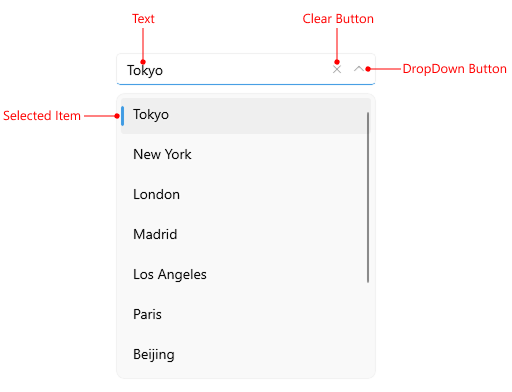
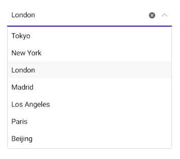
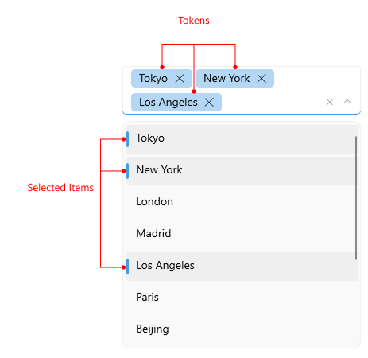

# .NET MAUI ComboBox Visual Structure

Here are described all visual elements used in the ComboBox for .NET MAUI.

## ComboBox Visual Structure

### Single Selection

### Multiple Selection

## DropDown Visual Structure

### Single Selection

### Multiple Selection

## Legend

- `Placeholder`&mdash;The text which is used to give guidance to the end user on what should be entered/searched in the input.
- `ClearButton`&mdash;Clears the selection of the control both multiple and single.
- `Tokens`&mdash;When multiple items are selected from the dropdown list, these items appear as tokens. They can easily be deselected using their close button.
- `SelectedItem`&mdash;The currently selected item.
- `SelectedItems`&mdash;The selected items, when multiple selection is used.
- `DropDownButton`&mdash;A button used for opening and closing the DropDown part of the control – the arrow icon of the button indicates whether it is currently opened or closed.
