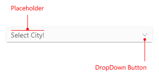

# .NET MAUI ComboBox Visual Structure

The visual structure of the [.NET MAUI ComboBox]() represents the anatomy of the UI control. Being familiar with the visual elements of the ComboBox allows you to quickly find the information required to configure them.

The images in this article show the anatomy of the ComboBox and its building blocks.

## ComboBox Visual Structure

- `Placeholder`&mdash;The text that guides the end-user on what can be entered/searched in the input.
- `DropDown Button`&mdash;A button used for opening and closing the DropDown part of the control–the arrow icon of the button indicates whether it's currently opened or closed.

## Single Selection Structure

- `Text`&mdash;The text entered in the control's input filed.
- `Clear Button`&mdash;Clears the selection in the control (for both multiple and single selection scenarios).
- `DropDown Button`&mdash;A button used for opening and closing the DropDown part of the control–the arrow icon of the button indicates whether it's currently opened or closed.
- `Selected Item`&mdash;The currently selected item.

## Tokens Structure

- `Tokens`&mdash;When multiple items are selected from the dropdown list, these items appear as tokens. They can be deselected using their close button.
- `ShowMore Template`&mdash;This template represents a UI that is displayed when the control is not focused and the space is insufficient to show all tokens in a multiple selection scenario.

## Multiple Selection Structure

- `Tokens`&mdash;When multiple items are selected from the dropdown list, these items appear as tokens. They can be deselected using their close button.
- `SelectedItems`&mdash;The selected items when multiple selection is used.
- `ShowMore Template`&mdash;This template represents a UI that is displayed when the control is not focused and the space is insufficient to show all tokens in a multiple selection scenario.

## Edit Mode Structure

- `Clear Button`&mdash;Clears the selection in the control (for both multiple and single selection scenarios).
- `DropDown Button`&mdash;A button used for opening and closing the DropDown part of the control–the arrow icon of the button indicates whether it's currently opened or closed.
- [`RadTextInput`]()&mdash;The control used for the text input.
- `Text`&mdash;The text entered in the control's input filed.
- `Highlighted Items`&mdash;The items that match the text entered in the input area.
