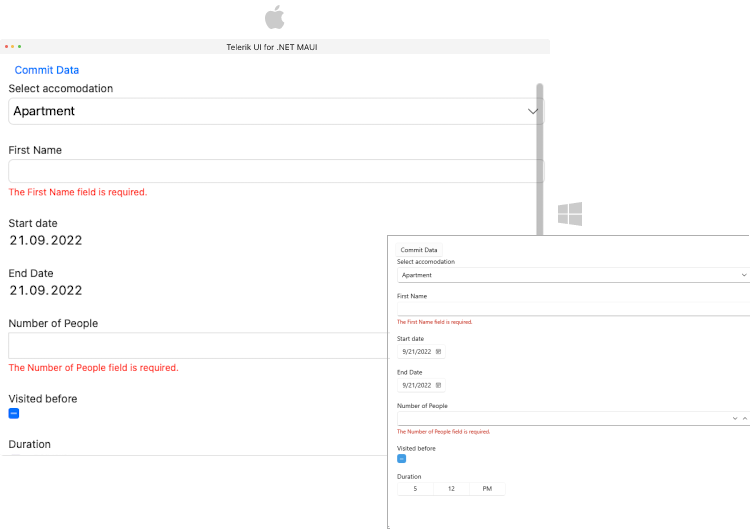

# .NET MAUI DataForm Commit Data

The values entered in the DataForm can be submitted to the underlying data object on three different occasions, using the `CommitMode` property of the DataForm.



The next sections list all DataForm members related to commit data feature.

## Commit modes

The selected mode is applied through the `CommitMode`(of type`Telerik.Maui.Controls.DataFormCommitMode`) property of the DataForm control. You can choose between the three commit modes:

* `Explicit`&mdash;The changes are committed explicitly by invoking the `CommitCommand` or calling the `CommitChanges` method of the DataForm.
* `LostFocus`&mdash;The changes are committed after the editor loses focus.
* `PropertyChanged`&mdash;The changes in the editor are committed immediately on each property change (when the property value changes).

>important When the selected `CommitMode` is `LostFocus`, you have to set `ValidatonMode` to `LostFocus` or `Explicit`.

The `CommitMode` can be applied globally to the RadDataForm 

```XAML
<telerik:RadDataForm x:Name="dataForm"
                     CommitMode="LostFocus"/>
```


## Properties

* `HasPendingChanges`(`bool`)&mdash;Gets a value indicating whether any changes are pending.

<snippet id='dataform-commit-mode'/>

## Manual Commit with Methods

DataForm exposes a `CommitChanges` method with two overloads:

* `CommitChanges()`&mdash;Commits all pending changes in the `RadDataForm` to the underlying business object. This method is useful when the `CommitMode` is `Explicit`.
The method returns `true` if the validation passes, otherwise `false`.

<snippet id='dataform-commit-changes'/>

* `CommitChanges(string propertyName)`&mdash;Commit the pending changes in the editor for the specified property. This method is useful when the DataForm `CommitMode` property is `Explicit`. `True` if the validation passes, `false` otherwise.

<snippet id='dataform-commit-changes-on-property'/>

**DataForm exposes a `CancleChanges` method with two overloads:**

* `CancelChanges`&mdash;Cancels all pending changes in the `RadDataForm` and reverts to the original values from the underlying business object. This method is useful when the `CommitMode` property is `Explicit`.

```C#
this.dataForm.CancelChanges();
```

* `CancelChanges(string propertyName)`&mdash;Cancels the pending changes in the editor for the specified property. This method is useful when the DataForm `CommitMode` property is `Explicit`.

<snippet id='dataform-cancelchanges-on-property'/>

## Commands

* `CommitCommand`(`ICommand`)&mdash;Gets a command to a command to commit all pending changes in the RadDataForm. This command is useful when the DataForm `CommitMode` property is `Explicit`.
* `CancelCommand`(`ICommand`)&mdash;Gets a command to cancel all pending changes in the `RadDataForm`. This command is useful when the DataForm `CommitMode` property is `Explicit`.

>important All commit methods call validation first. If the property value passes validation, then the corresponding validation finished event is raised and the value is committed successfully.

## See Also

- [Editors]()
- [Grouping]()
- [Headers]()
- [Layouts]()
- [Commands]()
