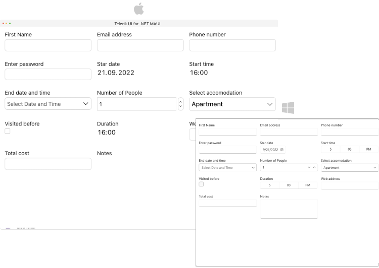

# .NET MAUI DataForm - Data Annotations 

Telerik .NET MAUI DataForm uses `Data Annotations`(`System.ComponentModel.DataAnnotations`).

The supported Data Annotations are described in the table below:

| Data Annotations |
| ------------- |
| [DisplayAttribute](https://learn.microsoft.com/en-us/dotnet/api/system.componentmodel.dataannotations.displayattribute?view=net-7.0) |
| [DataTypeAttribute](https://learn.microsoft.com/en-us/dotnet/api/system.componentmodel.dataannotations.datatypeattribute?view=net-7.0) |
| [DescriptionAttribute](https://learn.microsoft.com/en-us/dotnet/api/system.componentmodel.descriptionattribute?view=net-7.0) |
| [CategoryAttribute](https://learn.microsoft.com/en-us/dotnet/api/system.componentmodel.categoryattribute?view=net-7.0) |
| [ReadOnlyAttribute](https://learn.microsoft.com/en-us/dotnet/api/system.componentmodel.readonlyattribute?view=net-7.0) |
| [DisplayFormatAttribute](https://learn.microsoft.com/en-us/dotnet/api/system.componentmodel.dataannotations.displayformatattribute?view=net-7.0) |
| [BrowsableAttribute](https://learn.microsoft.com/en-us/dotnet/api/system.componentmodel.browsableattribute?view=net-7.0) |
| [ScaffoldColumnAttribute](https://learn.microsoft.com/en-us/dotnet/api/system.componentmodel.dataannotations.scaffoldcolumnattribute?view=net-7.0) |
| [RegularExpressionAttribute](https://learn.microsoft.com/en-us/dotnet/api/system.componentmodel.dataannotations.regularexpressionattribute?view=net-7.0) |
| [NotMappedAttribute](https://learn.microsoft.com/en-us/dotnet/api/system.componentmodel.dataannotations.schema.notmappedattribute?view=net-7.0) |
| [RequiredAttribute](https://learn.microsoft.com/en-us/dotnet/api/system.componentmodel.dataannotations.requiredattribute?view=net-7.0) |
| [RangeAttribute](https://learn.microsoft.com/en-us/dotnet/api/system.componentmodel.dataannotations.rangeattribute?view=net-7.0) |

> For more information about Data Annotations, refer to [Microsoft documentation](https://learn.microsoft.com/en-us/dotnet/api/system.componentmodel.dataannotations?view=net-7.0).

**Example with business model with Data Annotations**

The example uses the Required, DataType, Display and RegularExpression attributes:

<snippet id='dataform-datatype-editors-model'/>

## See Also

- [Editors]()
- [Grouping]()
- [Headers]()
- [Layouts]()
- [Commit Data]()
- [Commands]()

