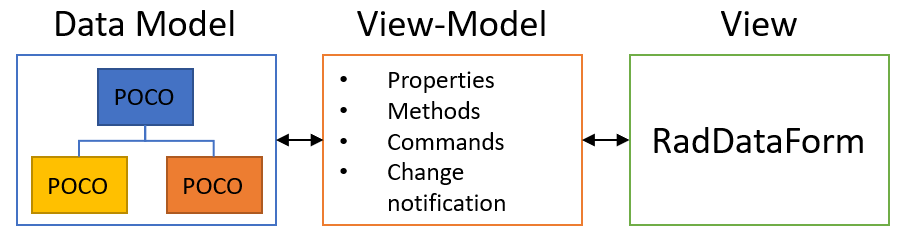

# Data Binding in .NET MAUI DataForm

The way to set the DataForm source is to use a class. This class must be set as a `BindingContext` to the DataForm control. Then you can decorate the properties defined in the class with data annotations. The [data annotations]() are used to build metadata for each property used by the data form to customize its UI.

>important DataForm gets the data from the `BindingContext` that you set.

The diagram below shows a typical setup in a MVVM application.



On the left side is the data model. Such model contains properties, no methods, no extra business logic, no `INotifyPropertyChanged` etc.

On the right side of the diagram resides the view presented to the user. The `RadDataForm` component can automate the generation of the view, but nothing else. The developer cannot pass the data model to the view directly. The developer needs some "glue" layer between the two. In the MVVM design pattern this role goes to the `ViewModel`. The `ViewModel` handles the following:

1. Expose all properties of the underlying data model to the view in a form that is convenient for visual representation.
1. Implement the `INotifyPropertyChanged` interface and provide the property change notifications.
1. Implement all business logic that is relevant for the current view, e. g. data retrieval, data manipulation etc.
1. Expose commands that responds to user interaction and trigger the necessary business logic.

## Auto-Generated Editors

The Editors and Groups are automatically generated by default. To prevent this, set the DataForm `AutoGenerateItems` property to `False`. The table below describes which editors will be automatically generated based on the type of the property defined in the class:

| Editor name 		 | Type | Input control |
|--------------------|------------|-------|
| `DataFormRadEntryEditor` (default)		 | `string` | `Telerik .NET MAUI RadEntry` |
| `DataFormRadNumericEditor` (default)		 | `double?` | `Telerik .NET MAUI RadNumericInput` 
| `DataFormRadComboBoxEditor` (default on desktop)		 | `enum` | `Telerik .NET MAUI RadComboBox` |
| `DataFormRadCheckBoxEditor` (default)		 | `bool?` | `Telerik .NET MAUI RadCheckBox` |
| `DataFormRadSegmentedEditor` (default on mobile)		 | `enum` | `Telerik .NET MAUI RadSegmentedControl` |
| `DataFormDatePickerEditor` (default)	 | `DateTime?` | ` .NET MAUI DatePicker` |
| `DataFormTimePickerEditor` (default)		| `TimeSpan?` | ` .NET MAUI TimePicker` |

Here is an example with automatically generated editors:

**1.** Use the following business model:

<snippet id='dataform-gettingstarted-model'/>

**2.** Define the DataForm:

<snippet id='dataform-gettingstarted-xaml'/>

**3.** The `BindingContext` set in page's code behind:

```C#
this.dataForm.BindingContext = new GettingStartedModel();
```


## Manually Generated Editors

Here is an example with automatically generated editors:

**1.** The `ViewModel` definition:

<snippet id='dataform-editors-model'/>

**2.** `RadDataForm` definition with `BindingContext` set and `AutoGenerateItems="False"`:

<snippet id='dataform-editors'/>

where the `local` points to the namespace where the `EditorsViewModel` is defined.


> For a runnable example with the DataForm Manually Generated Editors scenario, see the [SDKBrowser Demo Application]() and go to **DataForm > Editors** category.

## See Also

- [Editors]()
- [Grouping]()
- [Headers]()
- [Layouts]()
- [Commit Data]()
- [Commands]()