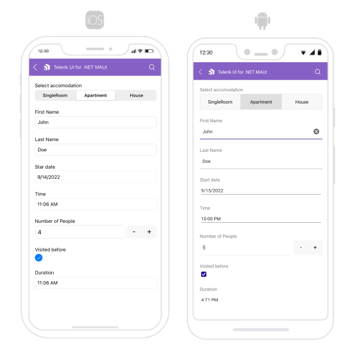

# Getting Started with the .NET MAUI DataForm

This guide provides the information you need to start using the Telerik UI for .NET MAUI DataForm by adding the control to your project.

At the end, you will achieve the following result.

## Prerequisites

Before adding the DataForm, you need to:

1. [Set up your .NET MAUI application](#step-1-set-up-your-net-maui-application).

1. [Download Telerik UI for .NET MAUI](#step-2-download-telerik-ui-for-net-maui).

1. [Install Telerik UI for .NET MAUI](#step-3-install-telerik-ui-for-net-maui).

1. [Register Required Handlers](#step-4-register-required-handlers-and-renderers).

## Define the Control

When your .NET MAUI application is set up, you are ready to add a DataForm control to your page. The following example demonstrates the definition of the `RadDataForm` with `ViewModel` defined.

### Binding to a complex object

Here is the DataForm definition:

<snippet id='dataform-gettingstarted-xaml'/>
<snippet id='dataform-gettingstarted-csharp'/>

and the Model used:

<snippet id='dataform-gettingstarted-model'/>

>important For the DataForm Getting Started example refer to the [SDKBrowser Demo Application]().

## Additional Resources

- [.NET MAUI DataForm Product Page](https://www.telerik.com/maui-ui/dataform)
- [.NET MAUI DataForm Forum Page](https://www.telerik.com/forums/maui?tagId=1979)
- [Telerik .NET MAUI Blogs](https://www.telerik.com/blogs/mobile-net-maui)
- [Telerik .NET MAUI Roadmap](https://www.telerik.com/support/whats-new/maui-ui/roadmap)

## See Also

- [Editors]()
- [Grouping]()
- [Headers]()
- [Layouts]()
- [Commit Data]()
- [Commands]()

