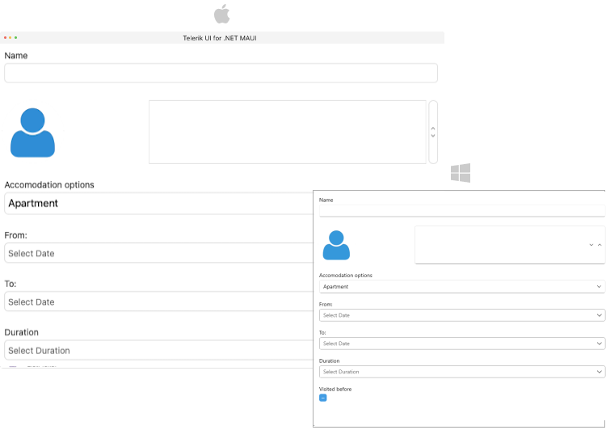
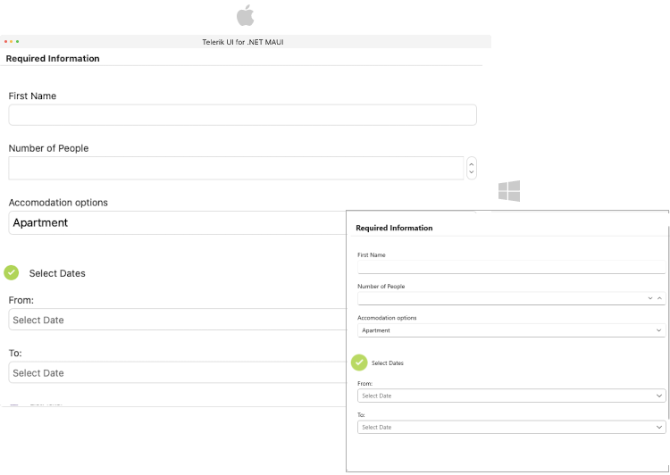

# .NET MAUI DataForm Headers

DataForm has headers for the Editors and for the Groups. 

## Header in Editors

You can use the following properties for header configuration:

* `HeaderText`(`string`)&mdash;Specifies the text of the header.
* `HeaderLength`(`Microsoft.Maui.GridLength?`)&mdash;Specifies the length of the header view in the editor. This property has an effect only when the `Telerik.Maui.Controls.DataFormEditor.HeaderPosition` property is `Beside`.
You can specify absolute values in pixels or weighted values followed by the asterisk symbol `*`. For instance, the value of `0.5*` specifies that the header length have to be 50% from the length of the corresponding editor. The special value `Auto` specifies that the header length have to be computed automatically for the header view, based on the header size requirements.
* `HeaderImageSource`(`Microsoft.Maui.Controls.ImageSource`)&mdash;Specifies the image in the header.
* `HeaderPosition`(`Telerik.Maui.Control.DataFormHeaderPosition?`)&mdash;Specifies the position of the header.
	* `Above`&mdash;The header label is placed above the input component in the Editor.
	* `Beside`&mdash;The header label is placed beside the input component in the Editor.

* `HeaderDisplayOptions`(`Telerik.Maui.Controls.DataFormHeaderDisplayOptions`)&mdash;Specifies the display options of the header. The available options are:
	* `None`&mdash;Header image and text are not visualized.
	* `Text`&mdash;Visualizes the header text. For this option `HeaderText` has to be defined.
	* `Image`&mdash;Visualizes the image in the header. For this option `HeaderImageSource` has to be defined.

You can combine the `Text` and the `Image` in the `HeaderDisplayOptions`. Here is a sample definition: `HeaderDisplayOptions="Image, Text"`.

* `HeaderTemplate`(`Microsoft.Maui.Controls.ControlTemplate`)&mdash;Specifies the template of the header view.

>note All Header properties for the Editors can be applied directly in the DataForm control and they will be common for all editors.

### Styling

For all styling options applied to the headers in the DataForm Editors review the DataForm [Header Styling]() article.

## Header for Groups

Each group has a header. Here are the properties you can use to configure the group header:

* `HeaderText`(`string`)&mdash;Specifies the text of the header.
* `HeaderImageSource`(`Microsoft.Maui.Controls.ImageSource`)&mdash;Specifies the image in the header.
* `HeaderDisplayOptions`(`Telerik.Maui.Controls.DataFormHeaderDisplayOptions`)&mdash;Specifies the display options of the header. The available options are:
	* `None`&mdash;Header image and text are not visualized.
	* `Text`&mdash;Visualizes the header text. For this option `HeaderText` has to be defined.
	* `Image`&mdash;Visualizes the image in the header. For this option `HeaderImageSource` has to be defined.

You can combine the `Text` and the `Image` in the `HeaderDisplayOption`. Here is a sample definition: `HeaderDisplayOptions="Image, Text"`.

* `HeaderTemplate`(`Microsoft.Maui.Controls.ControlTemplate`)&mdash;Specifies the template of the header view.

### Styling

For all styling options applied to the headers in the DataForm Groups review the DataForm [Header Styling]() article.

## See Also

- [Editors]()
- [Grouping]()
- [Layouts]()
- [Commit Data]()
- [Commands]()