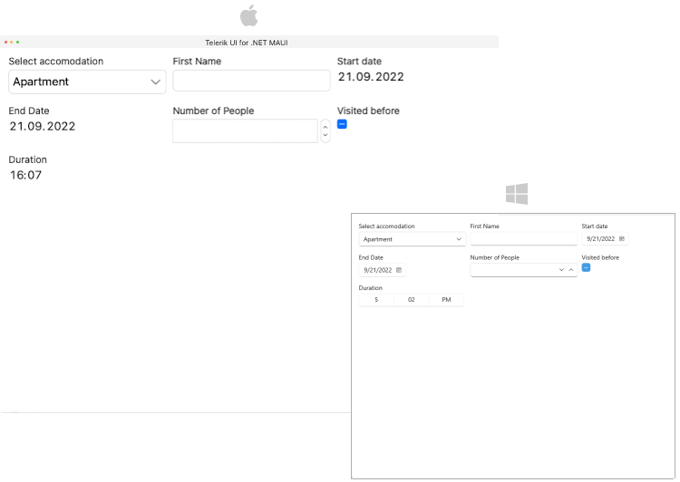

# .NET MAUI DataForm GridLayout Definition

The `DataFormGridLayout` definition allows you to arrange the items in a grid layout. The grid has a pre-defined number of columns(`2`). Starting from the top left corner, the items are arranged horizontally by columns, until the maximum number of columns is reached, then the process continues from the next row. Each item occupies only a single cell of the grid by default.

Use the following properties which the DataFormGridLayout provides: 

* `ColumnCount`(`int`)&mdash;Specifies the count of the columns in the grid layout. Default value is `2`.
* `ColumnSpacing`(`double`)&mdash;Specifies the spacing between the columns. Default value is `24`.
* `RowSpacing`(`bouble`)&mdash;Specifies the spacing between the rows in the grid layout. Default value is `24`.

> For more details about the GridLayout review the official [GridLayout Microsoft Documentation](https://docs.microsoft.com/en-us/dotnet/maui/user-interface/layouts/grid).

RadDataForm XAML definition with GridLayout applied:

<snippet id='dataform-layouts-grid'/>

The Model used for the DataForm editors

<snippet id='dataform-editors-model'/>

## See Also

- [VerticalStack Layout]()
- [Custom Layout]()