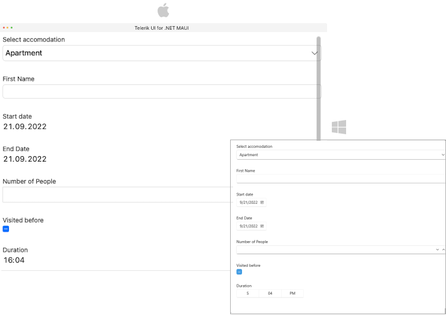

# .NET MAUI DataForm VerticalStackLayout Definition

The `DataFormVerticalStackLayout` definition allows you to arrange the items in a vertical stacklayout.

Use the `Spacing`(`double`) property to specify the spacing in pixels between the items in the layout. Default value is `24`.

**RadDataForm XAML definition with VerticalStackLayout applied:**

<snippet id='dataform-layouts-stack'/>

**The Model used for the DataForm editors**

<snippet id='dataform-editors-model'/>

## See Also

- [Grid Layout]()
- [Custom Layout]()