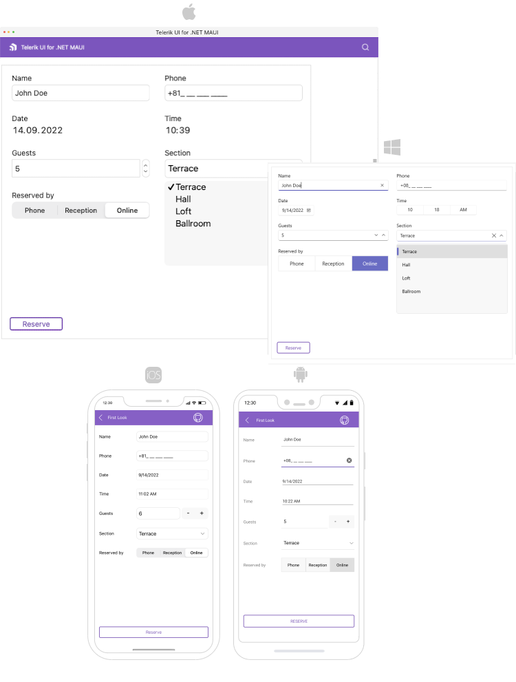

# .NET MAUI DataForm Overview

**Telerik UI for .NET MAUI DataForm** is a customizable component allowing you to easily create a form for collecting or editing business object data. The control supports different commit modes allowing you to commit property values one by one or commit the whole form at once. You could also determine at what moment the properties should be validated choosing between different validation modes. The control lets you use rich set of editors out of the box. In addition you can use the flexible styling API to customize the groups, editors, validaiton messages, etc. 

## Key features

* [Built-in editors]()&mdash;DataForm provides a set of built-in editors for the available primitive types such as numeric, string, boolean, enumerations, DateTime, TimeSpan. The control detects the types of the data object’s properties and automatically displays the appropriate editor.  

* [Validation support]()&mdash;Use the built-in validation support which gives you full control over the data collected through the control.

* [Commit modes]()&mdash;DataForm provides editing support with three types of commit modes to determine when the edited value should be synchronized with the business object.

* [Grouping]() support that allows you to easily group the editors.

* [Data annotations support]()&mdash;In order to customize the way data is interpreted in DataForm you can use helpers in the form of Data Annotations. Use annotations like Requres, DataType, Display, RegularExpression and more.

* [Different layouts]()&mdash;Arrange the editors and the groups using different layouts like stack, grid and more.

* [Commands support]() for validation and commit data and canceling the commit operation.

* [Flexible Styling API]() for customizing the look of the DataForm, its Editors, Groups and Headers. In addiiton you can customize the error and validation messages.

## Next Steps

- [Getting Started with Telerik UI for .NET MAUI DataForm]()

## See Also

- [.NET MAUI DataForm product page](https://www.telerik.com/maui-ui/dataform)
- [.NET MAUI DataForm forum page](https://www.telerik.com/forums/maui?tagId=1979)
- [Telerik .NET MAUI blogs](https://www.telerik.com/blogs/mobile-net-maui)
- [Telerik .NET MAUI roadmap](https://www.telerik.com/support/whats-new/maui-ui/roadmap)

