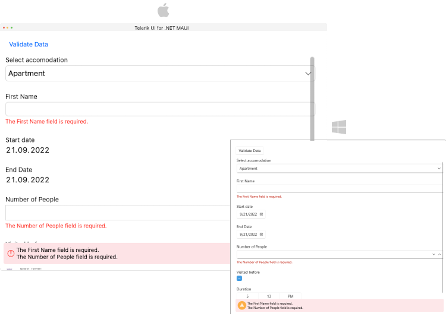
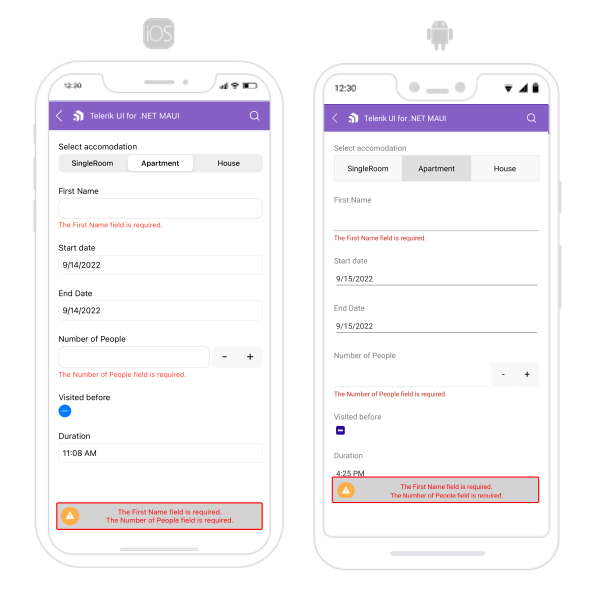
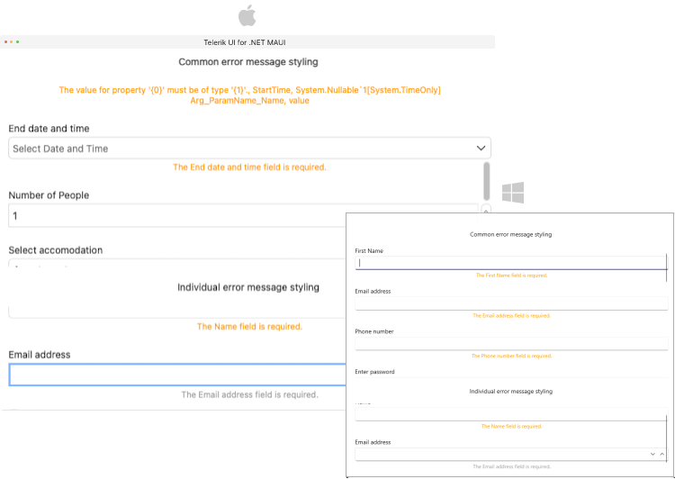

# .NET MAUI DataForm Validation

.NET MAUI DataForm provides built-in validation, which gives you full control over the data collected through the control. 



The next sections list all DataForm members related to validation.

## Validation Modes

The selected mode is applied through `ValidationMode` (of type`Telerik.Maui.Controls.DataFormValidationMode`) property of the DataForm control. You can choose between three validation modes:

* `Explicit`&mdash;The changes are validated explicitly by invoking the `ValidateCommand` or calling the `ValidateChanges` method of the DataForm.
* `LostFocus`&mdash;The changes are validated after the editor loses focus.
* `PropertyChanged`&mdash;The changes in the editor are validated immediately on each property change (when the property value changes).

>important When `ValidationMode` is `LostFocus`, you have to set `CommitMode` to `LostFocus` or `Explicit`.

The `ValidationMode` must be applied globally to the `RadDataForm`:

```XAML
<telerik:RadDataForm x:Name="dataForm"
                     ValidationMode="LostFocus"/>
```

## Validation Properties

* `HasValidationErrors`(`bool`)&mdash;Gets a value indicating whether it has validation errors.

## Events

DataForm exposes the following events for validation: 

* `ValidationCompleted`&mdash;Raised when the DataForm validation completes. The `ValidationCompleted` event handler receives two parameters:
	* `sender` argument which is of type object, but can be cast to the `RadDataForm` type. 
	* `DataFormObjectValidationCompletedEventArgs` which provides additional information for the validated `DataObject`, the `ValidationErros`(`IReadOnlyList` of `DataFormValidationError`) and whether it has validation errors `HasValidationErrors`(`bool`).

* `EditorValidationCompleted`&mdash;Raised when the validation of an editor has completed. The `EditorValidationCompleted` event handler receives two parameters:
    * `sender` argument which is of type object, but can be cast to the `RadDataForm` type. 
    * `DataFormEditorValidationCompletedEventArgs`  which provides additional information for the validated `PropertyName`, the original value ff the validated property `PropertyValue`(`object`) in the model and the modified value of the validated property in the editor - `EditorValue`(`object`).


## Manual Validation with Methods

DataForm exposes a `ValidateChanges` method with two overloads:

* `ValidateChanges()`&mdash;Executes the validation logic associated with the DataForm control. This method is useful when the `ValidationMode` is `Explicit`. The method returns `true` if the validation passes, otherwise `false`.

<snippet id='dataform-validatechanges'/>

* `ValidateChanges(string propertyName)`&mdash;Validates the pending changes in the editor for the specified property. This method is useful when the DataForm `ValidationMode` property is `Explicit`. `True` if the validation passes, `false` otherwise.

<snippet id='dataform-validatechanges-on-property'/>

> For a runnable example with the DataForm Validation scenario, see the [SDKBrowser Demo Application]() and go to **DataForm > Validation** category.

## Commands

* `ValidateCommand`(`ICommand`)&mdash;Gets a command to execute the validation logic of the `RadDataForm`. This command is useful when the DataForm `ValidationMode` property is `Explicit`.

## Validation Summary - Styling and Customization

The `ValidationSummaryMessage` displays all validation messages for the editors. You can visualize/hide the validation summary message by setting the `IsValidationSummaryVisible`(`bool`) property to `True`/`False`.

You can use the following properties for validation styling and customization:

* `ValidationSummaryImageSource`(`ImageSource`)&mdash;Specifies the `ImageSource` of the image displayed in the validation summary.
* `ValidationSummaryImageStyle`(`Style`)&mdash;Specifies the style applied to the image of the validation summary. The target type of this style is the .NET MAUI `Image` control.
* `ValidationSummaryStyle`(`Style`)&mdash;Specifies the style applied to the validation summary. The target type of this style is the `Telerik.Maui.Controls.DataFormValidationSummaryView`.         
* `ValidationSummaryLabelStyle`(`Style`)&mdash;Specifies the style applied to the labels of the validation summary. The target type of this style is the .NET MAUI `Label` control.



## Error Message - Styling and Customization

You can use the following properties for error message styling and customization:

* `ErrorImageSource`(`ImageSource`)&mdash;Specifies the `ImageSource` of the image displayed in the error message.
* `ErrorImageStyle`(`Style`)&mdash;Specifies the style applied to the image of the error message. The target type of this style is the .NET MAUI `Image` control.
* `ErrorLabelStyle`(`Style`)&mdash;Specifies the style applied to the labels of the error message. The target type of this style is the .NET MAUI `Label` control.



## See Also

- [Editors]()
- [Grouping]()
- [Headers]()
- [Layouts]()
- [Commit Data]()
- [Commands]()
