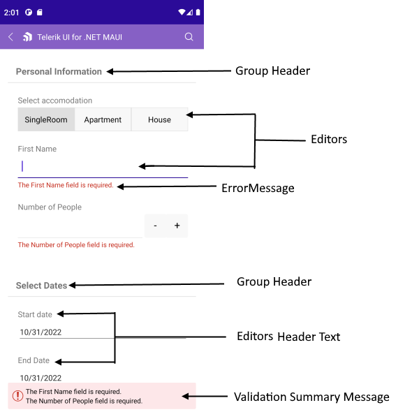

# .NET MAUI DataForm Visual Structure

The visual structure of the .NET MAUI DataForm represents the anatomy of the UI component. Being familiar with the visual elements of the DataForm allows you to quickly find the information required to configure them.

The following image shows the anatomy of the DataForm.

## Displayed Elements

* `Header`&mdash;Headers for the editors and for the groups.
* `Editor`&mdash;The editor in the DataForm control.
* `Groups`&mdash;The editors can be organized by groups.
* `Error Message for editor`&mdash;Error message when the input does not match the required data.
* `Summer error message`&mdash;The common error message displayed for all editors where the input data do not match the requirements.
