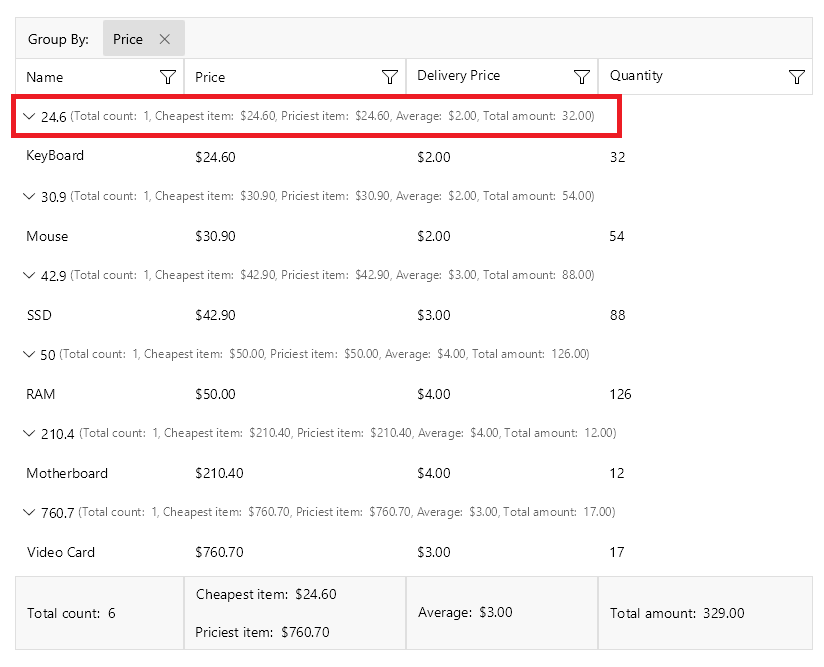
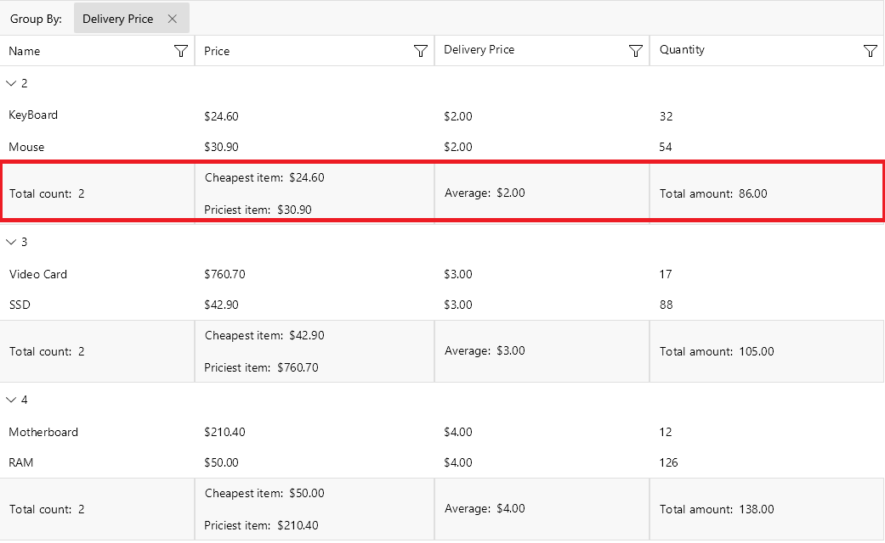

# .NET MAUI DataGrid Aggregates

The DataGrid exposes an Aggregates API through its `DataGridColumn.AggregateDescriptors` collection, where you can add `PropertyAggregateDescriptor` and `DelegateAggregateDescriptor`.





## Aggregate Descriptors

The [`PropertyAggregateDescriptor`]() enables you to use a set of available functions while the [`DelegateAggregateDescriptor`]() allows you to implement a custom function through the `IAggregateFunction` interface.

## Aggregates Visualization

Visualize the aggregates inside the:

* DataGrid Column Footer
* DataGrid Group Header
* DataGrid Group Footer

### Aggregates in Column Footer

Use the `ShowColumnFooters` property to visualize the [`ColumnFooters`]() of the DataGrid. When applying aggregate descriptor(s) to the column, the aggregate results are displayed inside the column footer.

> The aggregate results are displayed inside the column footer only if there is no `FooterText` set.

### Aggregates in Group Header

When [grouping]() is applied to the DataGrid, you can display the aggregate results for the groups data in the group header, next to the title of the group.

To show the Aggregates in the group header, set the `ShowGroupHeaderAggregates` to `True`.

To align the aggregates in the group according to its header set the `GroupAggregatesAlignment` (`enum` of type `Telerik.Maui.Controls.DataGrid.DataGridGroupAggregatesAlignment`) property. The available options are:

* (default)`None`&mdash;Aggregates are not aligned to the DataGrid columns. The aggregates results are displayed after the text displayed for the group key.
* `NextToHeader`&mdash;Aggregate results are aligned to the DataGrid columns and placed next to the header of the group.

### Aggregates in Group Footer

When [grouping]() is applied to the DataGrid, you can display the aggregate results for the groups data in the group footer.

To visualize the group footer, set the `ShowGroupFooters` property to `True`. The group footer is divided into cells which are aligned with the respective columns and show the aggregate results for the particular column.

>tip For an outline of all DataGrid features review the [.NET MAUI DataGrid Overview]() article.

## See Also

- [Property Aggregate Descriptor]()
- [Delegate Aggregate Descriptor]()
