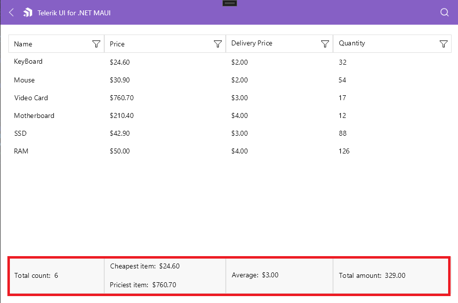

# Property Aggregate Descriptor

The `PropertyAggregateDescriptor` allows you to define a property and a function that are applied over the property values of the DataGrid, which accumulates an aggregated result based on the component data.

To set up the `PropertyAggregateDescriptor`, use the following properties:
* `PropertyName`&mdash;Defines the name of the property that is used to compute the aggregate value.
* `Function`&mdash;Defines a KnownFunction value that will be applied to the aggregate.
* `Caption`&mdash;Defines the caption of the aggregate. You can use `Caption` to display text in the UI.
* `Format`&mdash;Defines the string format that will be applied over the aggregated value.

The `PropertyAggregateDescriptor` supports the following `KnownFunction` aggregates:

* `Sum` - The `Sum` function sumarizes all values in the column.
* `Min` - The `Minimum` value of the cells in the column.
* `Max` - The `Maximum` value of the cells in the column.
* `Average` - The `Average` value of the cells in the column.
* `Count` - The `COUNT` function counts the items in the column.
* `Product` - The `PRODUCT` function multiplies all the numbers given as arguments and returns the product.
* `StdDev` - The `Standard Deviation` is a measure of how widely values are dispersed from the average value, based on a sample function.
* `StdDevP` - The `Standard Deviation` is a measure of how widely values are dispersed from the average value, based on the entire population function.
* `Var` - The `Variance` is a measure of dispersion, based on a sample function.
* `VarP` - The `Variance` is a measure of dispersion, based on the entire population function.

The following example shows how to add a `PropertyAggregateDescriptor` to the DataGrid's Columns. It will take the values from the `Name`, `Price`, `DeliveryPrice` and `Quantity` properties of the row model and the result will be the `Min` and `Max` prices as well as `Average` price for delivery and the `Count` of the listed items.

<snippet id='datagrid-property-aggregate-descriptor-example'/>

## See Also

- [Delegate Aggregate Descriptor]()