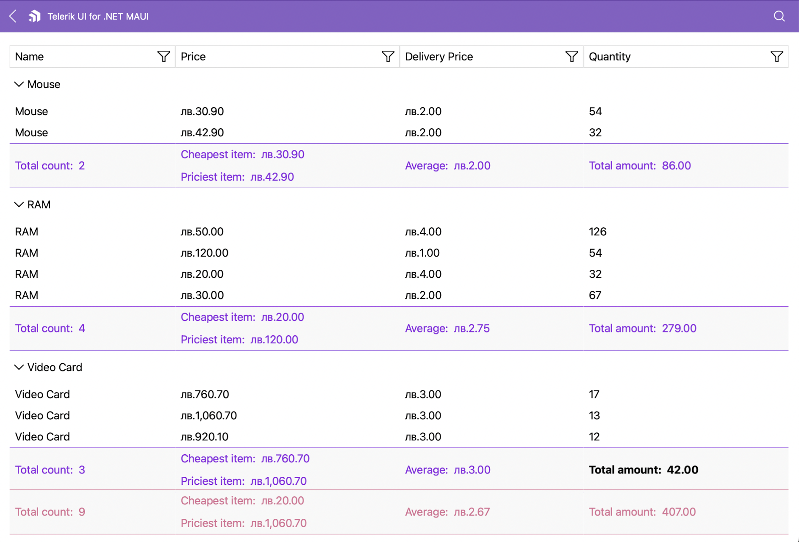

# .NET MAUI DataGrid Aggregates Styling

The .NET MAUI DataGrid provides a styling functionality for its group footer, header, and column footer aggregates.

## Style the Group Header

The [Telerik UI for .NET MAUI DataGrid]() provides the `GroupHeaderStyle` (of type `Style` with target type `DataGridGroupHeaderAppearance`) configuration, which defines the style of the `GroupHeader` and the aggregates inside the header. 

> To visualize the aggregates in the DataGrid group header, set the `ShowGroupHeaderAggregates` to `True`. The property is a property inside the `RadDataGrid` instance.

Use the following properties to style the `GroupHeader`:

| Property  | Description |
| ------ | ------ |
| `BackgroundColor` | Defines the color that fills the area within the header. |
| `BorderColor`| Defines the color that fills the border region. |
| `BorderThickness` | Defines the thickness of the border. |
| `ButtonFontAttributes` | Defines the font attributes for the expand/collapse symbol for the group headers. |
| `ButtonFontFamily` | Defines the font family for the  expand/collapse symbol of the `GroupHeader`. |
| `ButtonFontSize` | Defines the font size for the expand/collapse symbol of the `GroupHeader`. |
| `ButtonMargin` | Defines the margin for the expand/collapse symbol of the `GroupHeader`. |
| `ButtonTextColor` | Defines the color for the expand/collapse symbol of the `GroupHeader`. |
| `TextColor` | Defines the color for the text part of the `GroupHeader` |
| `TextFontAttributes` | Defines the font attributes for the text part of the `GroupHeader`. |
| `TextFontFamily` | Defines the font family for the text part of the `GroupHeader`. |
| `TextFontSize` | Defines the size for the text part of the `GroupHeader`. |
| `TextMargin` | Defines the margin for the text part of the `GroupHeader`. |

### Style the Aggregates in the Group Header

You can style the appearance of the aggregate results based on the value of the `GroupAggregatesAlignment` (`enum` of type `Telerik.Maui.Controls.DataGrid.DataGridGroupAggregatesAlignment`) property.

To style the aggregates in the group header when the value for the `GroupAggregatesAlignment` is `None`, use the `GroupHeaderStyle` (of type `Style` with target type `DataGridGroupHeaderAppearance`) property. 

The available properties in the `GroupHeaderStyle` are:

| Property  | Description |
| ------ | ------ |
| `AggregatesTextColor` | Defines the color for the aggregates part of the `GroupHeader` |
| `AggregatesTextFontAttributes` | Defines the font attributes for the aggregates part of the `GroupHeader` |
| `AggregatesTextFontFamily` | Defines the font family of the aggregates part of the `GroupHeader` |
| `AggregatesTextFontSize` | Defines the size of the aggregates part of the `GroupHeader` |
| `AggregatesTextMargin` | Defines the margin for the aggregates part of the `GroupHeader` |

The following example shows how to style the aggregate results in the group header when setting the `GroupHeaderStyle` in the page's resources:

<snippet id='datagrid-group-header-aggregate-styling-example'/>

To style and customize the aggregate results when setting the `GroupAggregatesAlignment` to `NextToHeader`, use the following properties:

* `GroupAggregateCellStyle` (of type `Style` with target type `DataGridGroupAggregateCellAppearance`)&mdash;Defines the style of the aggregates cell within the group header of the DataGrid. 
* `GroupAggregateCellStyleSelector` (`IStyleSelector`)&mdash;Allows you to set different styles for each aggregate within the group header of the DataGrid by passing the `GroupAggregateCellContext` in the selector.
* `GroupAggregateCellTemplate` (`DataTemplate`)&mdash;Defines the appearance of each aggregate within the group header of the DataGrid.

> The properties listed above are properties inside the `RadDataGrid` instance.
The table below describes the available properties for the `GroupAggregateCellStyle`:

| Property  | Description |
| ------ | ------ |
| `TextColor` | Defines the color of the cell text. |
| `FontAttributes` | Defines the font attributes for the text in the cell. |
| `FontFamily` | Defines the font family for the text in the cell. |
| `FontSize` | Defines the size for the text in the cell. |
| `Margin` | Defines the margin that is applied to the text of the cell. |

#### Example with the `GroupAggregateCellStyle`

**1.** Define the DataGrid in XAML:

<snippet id='datagrid-group-header-aggregates'/>

**2.** Define the `GroupAggregateCellStyle` in the page's resources:

<snippet id='datagrid-group-header-aggregate-nexttoheader-style-xaml'/>

**3.** Define the`DataModel`:

<snippet id='datagrid-aggregates-model'/>

**4.** Define the `ViewModel`:

<snippet id='datagrid-aggregates-viewmodel'/>

>important For the DataGrid `GroupHeaderAggregates Style` example refer to the [SDKBrowser Demo application]() and navigate to the **DataGrid > Aggregates** category.

#### Example with the `GroupAggregateCellStyleSelector`

**1.** Define the DataGrid in XAML:

<snippet id='datagrid-group-header-aggregates'/>

**2.** Define the `StyleSelector` class:

<snippet id='datagrid-group-header-aggregate-nexttoheader-style-xaml'/>

**3.** Define the `GroupAggregateCellStyleSelector` in the page's resources:

<snippet id='datagrid-group-header-aggregate-nexttoheader-style-xaml'/>

**4.** Define the `DataModel`:

<snippet id='datagrid-aggregates-model'/>

**5.** Define the `ViewModel`:

<snippet id='datagrid-aggregates-viewmodel'/>

>important For the DataGrid `GroupHeaderAggregates StyleSelector` example refer to the [SDKBrowser Demo application]() and navigate to the **DataGrid > Aggregates** category.

## Style the Group Footer

The DataGrid provides the following options for styling its group footer:

* `GroupFooterStyle` (of type `Style` with target type `DataGridColumnFooterAppearance`)&mdash;Defines the style of the `GroupFooter` and the aggregates inside the footer.
* `GroupFooterStyleSelector` (`IStyleSelector`)&mdash;Defines the style of the selected `GroupFooter` by passing the `GroupFooterContext` in the selector.
* `FooterStyle` (of type `Style` with target type `DataGridColumnFooterAppearance`)&mdash;Defines the style of the Column Footer and the aggregates inside the Column Footer.

> To visualize the `GroupFooter`, set the `ShowGroupFooters` property to `True`. The property is a property inside the `RadDataGrid` instance.

The following example shows how to define the `GroupFooterStyle` in XAML:

<snippet id='datagrid-group-aggregate-styling-example'/>

The following example shows how to use the `GroupFooterStyleSelector` property:

**1.** Define the class to which the `GroupFooterContext` will be passed.

<snippet id='datagrid-group-aggregate-style-selector'/>

**2.** Define the style selector which will passed to the DataGrid in XAML.

<snippet id='datagrid-group-aggregate-style-selector-xaml'/>

>important For the DataGrid `GroupFooter` Aggregates styling example refer to the [SDKBrowser Demo application]() and navigate to the **DataGrid > Aggregates** category.

### Customizing the Group Footer Appearance

Customizing the footer in the DataGrid also changes the appearance of the aggregates inside the component.

The following example demonstrates how to change the style of the column footer aggregates:

**1.** Define the footer style in XAML.

<snippet id='datagrid-column-aggregate-styling-example'/>

**2.** Add the styling to the DataGrid.

<snippet id='datagrid-aggregate-styling-example'/>

> The footer style is added per column.

The following image shows the end result.

>important For the DataGrid `GroupFooter` styling example refer to the [SDKBrowser Demo application]() and navigate to the **DataGrid > Aggregates** category.

## See Also

- [Property Aggregate Descriptor]()
- [Delegate Aggregate Descriptor]()
