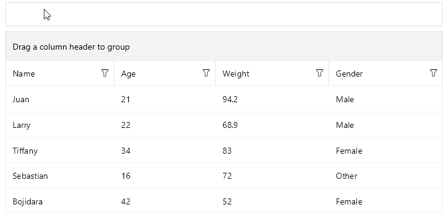

# .NET MAUI DataGrid Hover Cell

 The [Telerik UI for .NET MAUI DataGrid]() provides option to get the data of the cell that the mouse is currently over. In addition, you can change the default hover style. The feature is available only on Desktop - `WinUI` and `MacCatalyst`.

## Getting the Hovered Cell

The DataGrid provides a `VisualStateService` property (of type `DataGridVisualStateService`). This property gets the service that handles visual-state related logic, such as keeping track of the element that the mouse is currently over.

The `DataGridVisualStateService` class encapsulates visual state related logic such as mouse-hovered elements within a `Telerik.Maui.Controls.RadDataGrid` instance. This class exposes the `MouseHoverCell` property (`DataGridCellInfo`) which allows you to get the cell that the mouse is currently over.

Here is an example how to get the hovered cell.

```C#
var hoveredCell = dataGrid.VisualStateService.MouseHoverCell;
```

## Styling the Cell

You can specify the style for the cells and rows when the mouse is over by using the `MouseHoverStyle` property (of type `DataGridBorderStyle`) and applying the `BackgroundColor`, `BorderColor`, and `BorderThickness` properties.

## Example

Here is an example of how to get the mouse-hovered cell and how to apply styles to the hovered row.

**1.** Define sample data:

<snippet id='datagrid-persondetails' />

**2.** Define a sample `ViewModel`:

<snippet id='datagrid-reordering-viewmodel' />

**3.** Define the DataGrid in XAML:

<snippet id='datagrid-mousehovercell' />

**4.** Define the `MouseHoverStyle` in page;s resources:

<snippet id='datagrid-cells-hover-style' />

**5.** Add the `telerik` namespace:

```XAML
xmlns:telerik="http://schemas.telerik.com/2022/xaml/maui"
```

**6.** Subscribe to the `RadDataGrid.VisualStates.PropertyChanged`:

<snippet id='datagrid-visualstateservice-propertychanged' />

**7.** The `VisualStates.PropertyChanged` implementation with code how to get the `MouseHoverCell`:

<snippet id='visualstate-service' />

This is the result:



> For the runnable DataGrid Mouse Hover Cell example, see the [SDKBrowser Demo Application]() and go to **DataGrid > Cells**.

## See Also

- [Setting the .NET MAUI DataGrid Columns]()
- [Grouping in the DataGrid]()
- [Using the DataGrid Commands]()
- [Sorting .NET MAUI DataGrid Records]()
- [Filtering .NET MAUI DataGrid Records]()