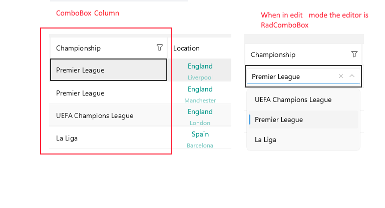

# .NET MAUI DataGrid ComboBoxColumn  

The `DataGridComboBoxColumn` uses the Telerik UI for .NET MAUI [ComboBox control]() in Edit mode to select a value from a list.

## Important Properties

Here are the specific properties defined for `DataGridComboBoxColumn`:

* `ItemsSource` (`IEnumerable<object>`)&mdash;This property is used when the source of the ComboBox items is not part of the data and is the same for all items in the grid.
* `ItemsSourcePath` (`string`)&mdash;Specifies a property of your data class that will be used as a source for the ComboBox control.
* `ItemDisplayBindingPath` (`string`)&mdash;Sets the display path of the items in the drop-down. It points to a field in the items from the `ItemsSource` collection of the ComboBox.
* `PropertyName`&mdash;Defines the name of the property of the object type that represents each row within the grid.
* `DataMemberBinding`&mdash;Defines the binding which points to the data member of the underlying object being displayed in the column's cell.
* `HeaderText`&mdash;Defines the content that will be displayed in the Header UI that represents the column.
* `CellContentStyle`(`DataGridTextCellStyle`)&mdash;Defines the appearance of each cell associated with this column. 
* `CellContentStyleSelector`&mdash;Defines the `StyleSelector` instance that allows for the dynamic appearance on a per-cell basis.
* `CellContentFormat`&mdash;Defines the custom format for each cell value. The `String.Format` routine is used and the format passed has to be in the form required by this method.
* `CellContentTemplate` (`DataTemplate`)&mdash;Defines the appearance of each cell associated with the concrete column. `CellContentTemplate` enables you to customize the default look of the cell.
* `CellContentTemplateSelector` (`DataTemplateSelector`)&mdash;Defines a `DataTemplateSelector` instance that may be used to retrieve dynamic data templates on a per-cell basis.
* `CellEditTemplate` (`DataTemplate`)&mdash;Defines the editor associated with the concrete column. The `CellEditTemplate` is displayed when the cell is in edit mode.
* `FilterControlTemplate`(`DataTemplate`)&mdash;Specifies the user defined template used for the Filtering UI. The template must contain an instance of the `Telerik.Maui.Controls.DataGrid.DataGridFilterControlBase` class.
* `FooterText`&mdash;Defines the content that will be displayed in the Footer UI that represents the column.
* `FooterStyle` (`DataGridColumnFooterStyle`)&mdash;Defines the `Style` object that sets the appearance of each footer cell associated with this column.
* `FooterContentTemplate` (`DataTemplate`)&mdash;Defines the appearance of the footer.
* `IsResizable`(`bool`)&mdash;Specifies whether the user can resize the DataGrid Column. The default value is `True`.This is only supported in `WinUI` and `MacCatalyst`.
* `IsFrozen`(`bool`)&mdash;Specifies whether the column is frozen. The default value is `False`.
* `DataGrid`(`RadDataGrid`)&mdash;Gets the corresponding `RadDataGrid` control.

>tip For more information about `CellDecorationStyle` and  `CellDecorationStyleSelector`, refer to the [Columns Styling]() topic.

>important `CellContentFormat` uses the format string provided by the framework. For more details, refer to the [String.Format](https://docs.microsoft.com/en-us/dotnet/api/system.string.format?view=netframework-4.8) article.

## Example

```XAML
<telerik:DataGridComboBoxColumn PropertyName="Country"
                                HeaderText="Country"
                                CellContentFormat="Picked: {0}"
                                ItemsSourcePath="Countries">
    <telerik:DataGridComboBoxColumn.CellContentStyle>
        <telerik:DataGridTextCellStyle SelectedTextColor="DarkGreen"
                                       TextColor="Black"
                                       FontSize="15" />
    </telerik:DataGridComboBoxColumn.CellContentStyle>
</telerik:DataGridComboBoxColumn>
```



**Example with CellContentTemplate and CellEditTemplate**

```XAML
 <telerik:DataGridComboBoxColumn PropertyName="Country"
                                 HeaderText="Country"
                                 ItemsSourcePath="Countries">
	<telerik:DataGridColumn.CellContentTemplate>
        <DataTemplate>
            <Grid>
                <VerticalStackLayout InputTransparent="True">
                    <Grid BackgroundColor="Orange"
                          Margin="0, 10, 0, 0">
                        <Label Text="{Binding Country}"
                               Margin="0, 5, 0, 5"
                               HorizontalOptions="Center"
                               VerticalTextAlignment="Center" /> 
                    </Grid>
                    <Label Text="Some Custom Text"
                           TextColor="DarkGreen"
                           FontSize="10" />  
                </VerticalStackLayout>
            </Grid>
        </DataTemplate>
    </telerik:DataGridColumn.CellContentTemplate>	
	<telerik:DataGridColumn.CellEditTemplate>
        <DataTemplate>
           <!-- add the control here for example: <Picker/> <telerik:RadComboBox/>-->
        </DataTemplate>
    </telerik:DataGridColumn.CellEditTemplate>						 
</telerik:DataGridComboBoxColumn>
```

## See Also

- [Columns Styling]()
- [Text Column]()
- [Time Column]()
