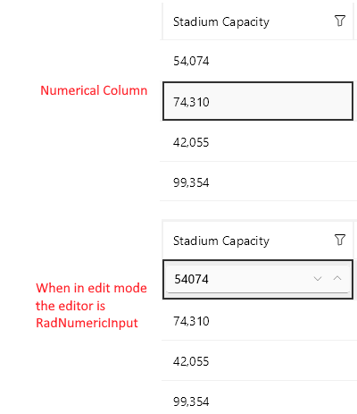

# .NET MAUI DataGrid NumericalColumn

The `DataGridNumericalColumn` is used to represent only numerical values. It uses the Telerik UI for .NET MAUI [NumericInput control]() to edit the value in `EditMode`. The difference between this column and the text one is that it will directly invoke the numeric keyboard on the mobile devices.

## Important Properties

* `PropertyName`&mdash;Specifies the name of the property of the object type that represents each row within the grid.
* `DataMemberBinding`&mdash;Defines the binding which points to the data member of the underlying object being displayed in the column's cell.
* `HeaderText`&mdash;Defines the content that will be displayed in the Header UI that represents the column.
* `CellContentStyle`(`DataGridTextCellStyle`)&mdash;Defines the appearance of each cell associated with this column. 
* `CellContentStyleSelector`&mdash;Defines the `StyleSelector` instance that allows for the dynamic appearance on a per-cell basis.
* `CellContentFormat`&mdash;Defines the custom format for each cell value. The `String.Format` routine is used and the format passed has to be in the form required by this method.
* `CellContentTemplate` (`DataTemplate`)&mdash;Defines the appearance of each cell associated with the concrete column. `CellContentTemplate` enables you to customize the default look of the cell.
* `CellContentTemplateSelector` (`DataTemplateSelector`)&mdash;Defines a `DataTemplateSelector` instance that may be used to retrieve dynamic data templates on a per-cell basis.
* `CellEditTemplate` (`DataTemplate`)&mdash;Defines the editor associated with the concrete column. The `CellEditTemplate` is displayed when the cell is in edit mode.
* `FooterText`&mdash;Defines the content that will be displayed in the Footer UI that represents the column.
* `FooterStyle` (`DataGridColumnFooterStyle`)&mdash;Defines the `Style` object that sets the appearance of each footer cell associated with this column.
* `FooterContentTemplate` (`DataTemplate`)&mdash;Defines the appearance of the footer.
* `IsResizable`(`bool`)&mdash;Specifies whether the user can resize the DataGrid Column. The default value is `True`.This is only supported in `WinUI` and `MacCatalyst`.
* `IsFrozen`(`bool`)&mdash;Specifies whether the column is frozen. The default value is `False`.
* `DataGrid`(`RadDataGrid`)&mdash;Gets the corresponding `RadDataGrid` control.

>tip For more information about `CellDecorationStyle` and  `CellDecorationStyleSelector`, refer to the [Columns Styling]() topic.

>important `CellContentFormat` uses the format string provided by the framework. For more details, refer to the [Standard Numeric Formatting](https://docs.microsoft.com/en-us/dotnet/standard/base-types/standard-numeric-format-strings) and [Custom Numeric Formatting](https://docs.microsoft.com/en-us/dotnet/standard/base-types/custom-numeric-format-strings) articles.

## Example

```XAML
<telerik:DataGridNumericalColumn PropertyName="StadiumCapacity"
                                     HeaderText="Stadium Capacity"
                                     CellContentFormat=" Seats - {0:D}">
    <telerik:DataGridNumericalColumn.CellContentStyle>
        <telerik:DataGridTextCellStyle TextColor="Green"
                                           FontSize="18"
                                           SelectedTextColor="LightCoral" />
    </telerik:DataGridNumericalColumn.CellContentStyle>
</telerik:DataGridNumericalColumn>
```



**Example with CellContentTemplate and CellEditTemplate**

```XAML
<telerik:DataGridNumericalColumn PropertyName="StadiumCapacity">
	<telerik:DataGridColumn.CellContentTemplate>
        <DataTemplate>
            <Label Text="{Binding StadiumCapacity}"/>
        </DataTemplate>
    </telerik:DataGridColumn.CellContentTemplate>
    <telerik:DataGridColumn.CellEditTemplate>
        <DataTemplate>
            <telerik:RadDockLayout>
                <Button Text="OK" Command="{Binding CommitEditCommand}" telerik:RadDockLayout.Dock="Right" />
                <Button Text="X" Command="{Binding CancelEditCommand}"  telerik:RadDockLayout.Dock="Right"/>
                <Slider Maximum="80000" Minimum="30000" 
                        Value="{Binding Item.StadiumCapacity}" 
                        HorizontalOptions="FillAndExpand" />
            </telerik:RadDockLayout>
        </DataTemplate>
    </telerik:DataGridColumn.CellEditTemplate>
</telerik:DataGridNumericalColumn>
```

## See Also

- [Columns Styling]()
- [Boolean Column]()
- [Date Column]()
