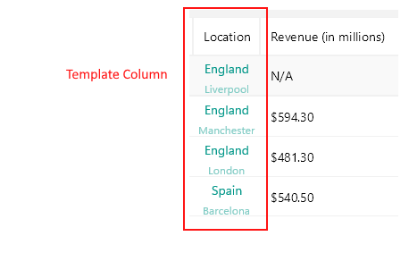

# .NET MAUI DataGrid TemplateColumn

If you want to completely customize the content of the cells in a grid column, you can use `DataGridTemplateColumn`, which utilizes a `DataTemplate` to describe the content of each associated grid cell.

## Important Properties

* `HeaderText`&mdash;Defines the content that will be displayed in the Header UI that represents the column.
* `SortDescriptor` (`SortDescriptorBase`)
* `GroupDescriptor` (`GroupDescriptorBase`)
* `CellContentTemplate` (`DataTemplate`)&mdash;Defines the `DataTemplate` instance that sets the appearance of each cell associated with this column.
* `CellContentTemplateSelector` (`DataTemplateSelector`)&mdash;Defines a `DataTemplateSelector` instance that may be used to retrieve dynamic data templates on a per-cell basis.
* `FooterText`&mdash;Defines the content that will be displayed in the Footer UI that represents the column.
* `FooterStyle` (`DataGridColumnFooterStyle`)&mdash;Defines the `Style` object that sets the appearance of each footer cell associated with this column.
* `FooterContentTemplate` (`DataTemplate`)&mdash;Defines the appearance of the footer.
* `IsResizable`(`bool`)&mdash;Specifies whether the user can resize the DataGrid Column. The default value is `True`.This is only suppoted in WinUI and MacCatalyst.
* `IsFrozen`(`bool`)&mdash;Specifies whether the column is frozen. The default value is `False`.

>important For more information about sorting and grouping, refer to the [DataGrid Sorting]() and [DataGrid Grouping]() articles.

## Sorting and Grouping for Template Column

The example below shows how to apply sorting and grouping to the DataGrid Template Column.

Here is how the `VieWModel` and the business object are defined:

```C#
public class ViewModel
{
    public ViewModel()
    {
        var source = new ObservableCollection<Person>();
        source.Add(new Person() { Name = "Kiko", Age = 23 });
        source.Add(new Person() { Name = "Jerry", Age = 23 });
        source.Add(new Person() { Name = "Ethan", Age = 51 });
        source.Add(new Person() { Name = "Isabella", Age = 23 });
        source.Add(new Person() { Name = "Joshua", Age = 51 });
        source.Add(new Person() { Name = "Logan", Age = 51 });
        source.Add(new Person() { Name = "Aaron", Age = 23 });

        this.Data = source;
    }

    public ObservableCollection<Person> Data { get; set; }
}

public class Person
{
    public string Name { get; set; }
    public int Age { get; set; }
}
```

Define the DataGrid:

```XAML
<telerik:RadDataGrid AutoGenerateColumns="False"
                             ItemsSource="{Binding Data}"
                             UserSortMode="Multiple">
    <telerik:RadDataGrid.BindingContext>
        <local:ViewModel/>
    </telerik:RadDataGrid.BindingContext>
    <telerik:RadDataGrid.Columns>
		<telerik:DataGridTextColumn PropertyName="Name"
	                                        HeaderText="Name"
	                                        CanUserSort="True"/>
        <telerik:DataGridTemplateColumn HeaderText="Age"
                                                CanUserSort="True">
            <telerik:DataGridTemplateColumn.CellContentTemplate>
                <DataTemplate>
                    <Label Text="{Binding Age}" />
                </DataTemplate>
            </telerik:DataGridTemplateColumn.CellContentTemplate>

            <!-- Tell the DataGrid to sort using Age property with a SortDescriptor -->
            <telerik:DataGridTemplateColumn.SortDescriptor>
                <telerik:PropertySortDescriptor PropertyName="Age" />
            </telerik:DataGridTemplateColumn.SortDescriptor>

            <!-- Tell the DataGrid to group using Age property with a GroupDescriptor -->
            <telerik:DataGridTemplateColumn.GroupDescriptor>
                <telerik:PropertyGroupDescriptor PropertyName="Age" />
            </telerik:DataGridTemplateColumn.GroupDescriptor>
        </telerik:DataGridTemplateColumn>
    </telerik:RadDataGrid.Columns>
</telerik:RadDataGrid>
```



## See Also

- [Columns Styling]()
- [Boolean Column]()
- [Date Column]()
