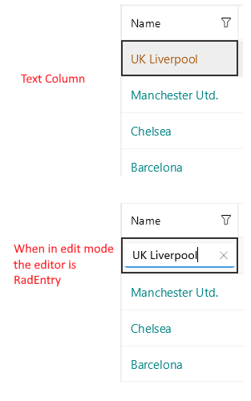

# .NET MAUI DataGrid TextColumn

A `DataGridTextColumn` converts the content of each associated cell to a `System.String` object.

>note A `DataGridTextColumn` performs better than a `DataGridTemplateColumn`.

## Important Properties

Here are the specific properties for the Text Columns:

* `PropertyName`&mdash;Specifies the name of the property of the object type that represents each row within the grid.
* `HeaderText`&mdash;Defines the content that will be displayed in the Header UI that represents the column.
* `CellContentFormat`&mdash;Defines the custom format for each cell value. The `String.Format` routine is used and the format passed has to be in the form required by this method.
* `CellContentStyle`&mdash;Defines the `Style` object that sets the appearance of each cell associated with this column.
* `CellContentStyleSelector`&mdash;Defines the `StyleSelector` instance that allows for the dynamic appearance on a per-cell basis.
* `CellContentTemplate` (`DataTemplate`)&mdash;Defines the appearance of each cell associated with the concrete column. `CellContenTemplate` enables you to customize the default content of the cell.
* `CellEditTemplate` (`DataTemplate`)&mdash;Defines the editor associated with the concrete column. The `CellEditTemplate` is displayed when the cell is in edit mode.
* `FooterText`&mdash;Defines the content that will be displayed in the Footer UI that represents the column.
* `FooterStyle` (`DataGridColumnFooterStyle`)&mdash;Defines the `Style` object that sets the appearance of each footer cell associated with this column.
* `FooterContentTemplate` (`DataTemplate`)&mdash;Defines the appearance of the footer.
* `IsResizable`(`bool`)&mdash;Specifies whether the user can resize the DataGrid Column. The default value is `True`.This is only supported in `WinUI` and `MacCatalyst`.
* `IsFrozen`(`bool`)&mdash;Specifies whether the column is frozen. The default value is `False`.

>tip For more information about `CellDecorationStyle` and  `CellDecorationStyleSelector`, refer to the [Columns Styling]() topic.

>important `CellContentFormat` uses the format string provided by the framework. For more details, refer to the [`String.Format`](https://docs.microsoft.com/en-us/dotnet/api/system.string.format?view=netframework-4.8) article.

## Example

Here is an example how the Text Column properties can be used:

```XAML
<telerik:DataGridTextColumn PropertyName="Name"
                            HeaderText="Name"
							CellContentFormat="FC {0}">
	<telerik:DataGridTextColumn.CellContentStyle>
    	<telerik:DataGridTextCellStyle TextColor="Green"
                                       FontSize="15"
                                       SelectedTextColor="Orange"/>
 	</telerik:DataGridTextColumn.CellContentStyle>
 </telerik:DataGridTextColumn>
```



**Example with CellContentTemplate and CellEditTemplate**

```XAML
<telerik:DataGridTextColumn PropertyName="Name" 
							HeaderText="Name">
	<telerik:DataGridColumn.CellContentTemplate>
		<DataTemplate>
			<Label Text="{Binding Name}" 
				   LineBreakMode="TailTruncation"
				   VerticalOptions="Center"/>
		</DataTemplate>
	</telerik:DataGridColumn.CellContentTemplate>
	<telerik:DataGridColumn.CellEditTemplate>
		<DataTemplate>
			<Entry Text="{Binding Item.Name, Mode=TwoWay}" Margin="5"/>
		</DataTemplate>
	</telerik:DataGridColumn.CellEditTemplate>
</telerik:DataGridTextColumn>
```

## See Also

- [Columns Styling]()
- [Numerical Column]()
- [Boolean Column]()
