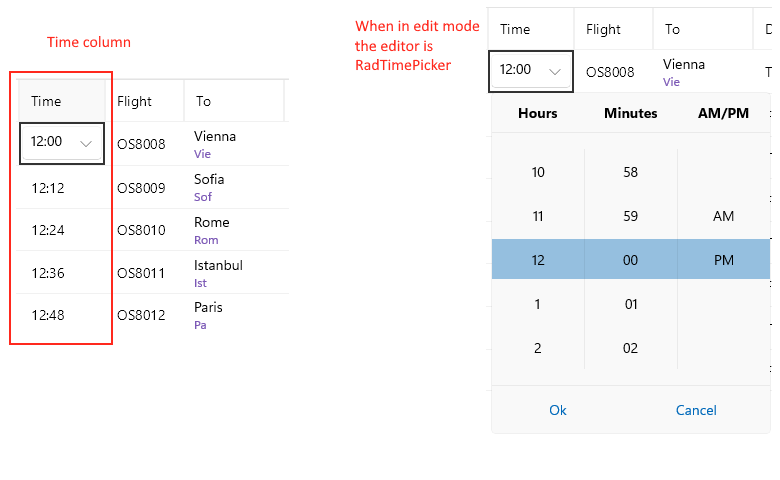

# .NET MAUI DataGrid TimeColumn

The `DataGridTimeColumn` is used to represent `TimeSpan` objects. It uses the Telerik UI for .NET MAUI [TimePicker control]() to pick a value in `EditMode`.

## Important Properties

* `PropertyName`&mdash;Specifies the name of the property of the object type that represents each row within the grid.
* `HeaderText`&mdash;Defines the content that will be displayed in the Header UI that represents the column.
* `CellContentStyle`&mdash;Defines the `Style` object that sets the appearance of each cell associated with this column. The `TargetType` of the `Style` has to be of the `TextBlock` type.
* `CellContentStyleSelector`&mdash;Defines the `StyleSelector` instance that allows for the dynamic appearance on a per-cell basis.
* `CellContentFormat`&mdash;Defines the custom format for each cell value. The `String.Format` routine is used and the format passed has to be in the form required by this method.
* `CellContentTemplate` (`DataTemplate`)&mdash;Defines the appearance of each cell associated with the concrete column. `CellContenTemplate` enables you to customize the default content of the cell.
* `CellEditTemplate` (`DataTemplate`)&mdash;Defines the editor associated with the concrete column. The `CellEditTemplate` is displayed when the cell is in edit mode.
* `FooterText`&mdash;Defines the content that will be displayed in the Footer UI that represents the column.
* `FooterStyle` (`DataGridColumnFooterStyle`)&mdash;Defines the `Style` object that sets the appearance of each footer cell associated with this column.
* `FooterContentTemplate` (`DataTemplate`)&mdash;Defines the appearance of the footer.
* `IsResizable`(`bool`)&mdash;Specifies whether the user can resize the DataGrid Column. The default value is `True`.This is only supported in `WinUI` and `MacCatalyst`.
* `IsFrozen`(`bool`)&mdash;Specifies whether the column is frozen. The default value is `False`.

>tip For more information about `CellDecorationStyle` and `CellDecorationStyleSelector`, refer to the [Columns Styling]() topic.

>important `CellContentFormat` uses the format string provided by the framework. For more details, refer to the [Standard Date and Time Formatting](https://docs.microsoft.com/en-us/dotnet/standard/base-types/standard-date-and-time-format-strings) and [Custom Date and Time Formatting](https://docs.microsoft.com/en-us/dotnet/standard/base-types/custom-date-and-time-format-strings) articles.


```XAML
<telerik:DataGridTimeColumn PropertyName="Time"
                            HeaderText="Time Column"
                            CellContentFormat="{}{0: hh:mm:ss}">
    <telerik:DataGridTimeColumn.CellContentStyle>
        <telerik:DataGridTextCellStyle TextColor="Lime"
                                       FontSize="18"
                                       SelectedTextColor="Red" />
    </telerik:DataGridTimeColumn.CellContentStyle>
</telerik:DataGridTimeColumn>
```



**Example with CellContenTemplate and CellEditTemplate**

```XAML
<telerik:DataGridTimeColumn PropertyName="Time" 
							HeaderText="Time">
	<telerik:DataGridColumn.CellContentTemplate>
		<DataTemplate>
			<Label Text="{Binding Time}"/>
		</DataTemplate>
	</telerik:DataGridColumn.CellContentTemplate>
	<telerik:DataGridColumn.CellEditTemplate>
		<DataTemplate>
			<telerik:RadTimePicker Time="{Binding Time}"/>
		</DataTemplate>
	</telerik:DataGridColumn.CellEditTemplate>
</telerik:DataGridDateColumn>
```

## See Also

- [Columns Styling]()
- [Text Column]()
- [Date Column]()
