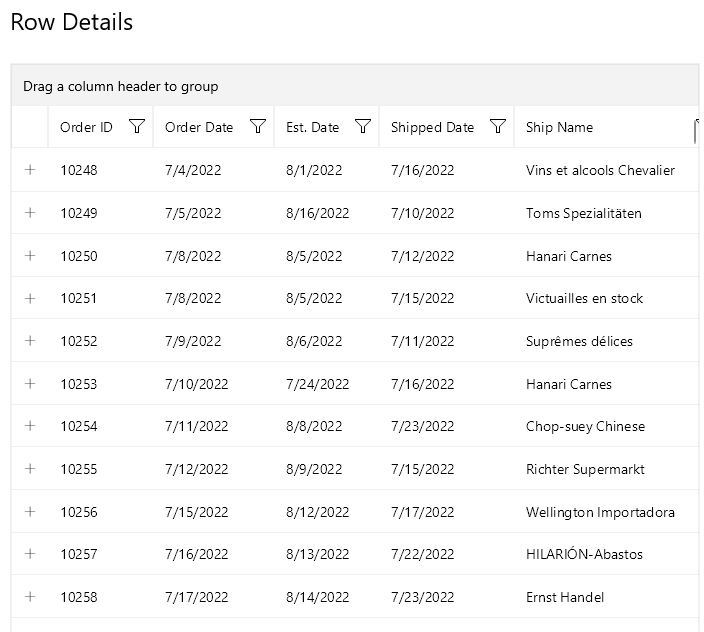

# .NET MAUI DataGrid Toggle Row Details Column

The `DataGridToggleRowDetailsColumn` represents `DataGridColumn` that allows the user to show and hide the row details for an item.

## See Also

- [Columns Styling]()
- [Numerical Column]()
- [Boolean Column]()