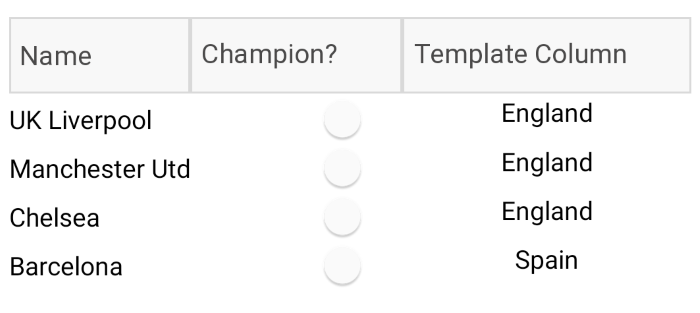
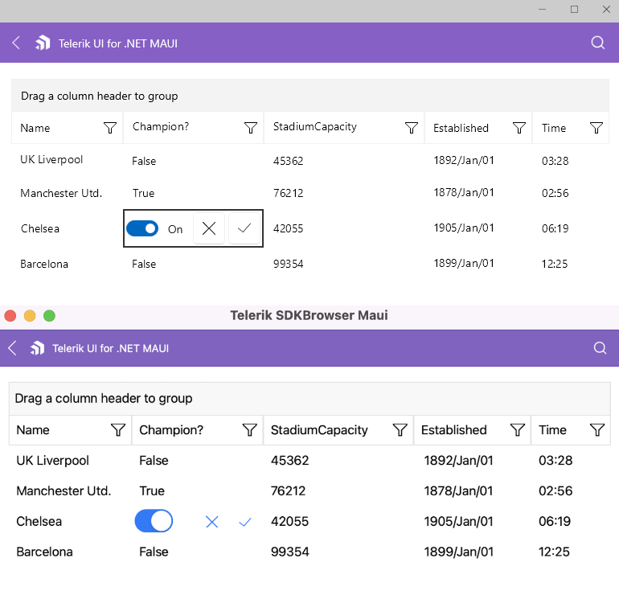

# Columns Cell Templates

This article describes how to set the content and edit templates to the DataGrid column using the **CellContentTemplate** and **CellEditTemplate** properties.

* **CellContentTemplate** (DataTemplate): Defines the appearance of each cell associated with the concrete column. CellContenTemplate gives you the opportunity to wrap the text inside each datagrid column. You can add a Label as a content of the Text, Template Column and wrap its text using the Label's **LineBreakMode** property.
* **CellEditTemplate** (DataTemplate): Defines the editor associated with the concrete column. The CellEditTemplate is displayed when the cell is in edit mode.

## Cell Content Template Example

Use the following snippet to declare a RadDataGrid in XAML: 

```XAML
<telerikDataGrid:RadDataGrid x:Name="dataGrid" 
                             ItemsSource="{Binding Clubs}" 
                             AutoGenerateColumns="False" 
                             UserEditMode="Cell">
    <telerikDataGrid:RadDataGrid.Columns>
        <telerikDataGrid:DataGridTextColumn PropertyName="Name" 
                                            Width="100"
                                            SizeMode="Fixed"
                                            HeaderText="Name">
            <telerikDataGrid:DataGridColumn.CellContentTemplate>
                <DataTemplate>
                    <Label Text="{Binding Name}" 
                           LineBreakMode="TailTruncation"
                           VerticalOptions="Center"/>
                </DataTemplate>
            </telerikDataGrid:DataGridColumn.CellContentTemplate>
        </telerikDataGrid:DataGridTextColumn>

        <telerikDataGrid:DataGridBooleanColumn PropertyName="IsChampion" 
                                               HeaderText="Champion?">
            <telerikDataGrid:DataGridColumn.CellContentTemplate>
                <DataTemplate>
                    <Switch IsToggled="{Binding IsChampion}"
                            VerticalOptions="Center"/>
                </DataTemplate>
            </telerikDataGrid:DataGridColumn.CellContentTemplate>
        </telerikDataGrid:DataGridBooleanColumn>

        <telerikDataGrid:DataGridTemplateColumn HeaderText="Template Column">
            <telerikDataGrid:DataGridColumn.CellContentTemplate>
                <DataTemplate>
                    <Label Text="{Binding Country}" 
                           Margin="0, 5, 0, 5"
                           HorizontalOptions="Center"
                           VerticalTextAlignment="Center"/>
                </DataTemplate>
            </telerikDataGrid:DataGridColumn.CellContentTemplate>
        </telerikDataGrid:DataGridTemplateColumn>
    </telerikDataGrid:RadDataGrid.Columns>
</telerikDataGrid:RadDataGrid>
```

And add the following namespaces:

```xml
xmlns:telerikDataGrid="clr-namespace:Telerik.XamarinForms.DataGrid;assembly=Telerik.Maui.Controls.Compatibility"
```

The **ViewModel** class is declared as following:

```C#
public class ColumnsViewModel
{
    private ObservableCollection<Club> clubs;

    public ObservableCollection<Club> Clubs => clubs ?? (clubs = CreateClubs());

    private ObservableCollection<Club> CreateClubs()
    {
        return new ObservableCollection<Club>
        {
            new Club("UK Liverpool ", new DateTime(1892, 1, 1), new DateTime(2018, 2, 22, 3, 28, 33), 45362, "England"),
            new Club("Manchester Utd.", new DateTime(1878, 1, 1), new DateTime(2018, 1, 1, 2, 56, 44), 76212, "England") { IsChampion = true },
            new Club("Chelsea", new DateTime(1905, 1, 1), new DateTime(2018, 6, 17, 6, 19, 59), 42055, "England"),
            new Club("Barcelona", new DateTime(1899, 1, 1), new DateTime(2018, 7, 12, 12, 25, 31), 99354, "Spain")
        };
    }
}
```
	
And the **Club** custom object:

```C#
public class Club : INotifyPropertyChanged
{
    private string name;
    private DateTime established;
    private DateTime time;
    private int stadiumCapacity;
    private bool isChampion;
    private string country;

    public Club(string name, DateTime established, DateTime time, int stadiumCapacity, string country)
    {
        Name = name;
        Established = established;
        Time = time;
        StadiumCapacity = stadiumCapacity;
        Country = country;
    }

    public string Name
    {
        get { return this.name; }
        set { this.UpdateValue(ref this.name, value); }
    }
    public DateTime Established
    {
        get { return this.established; }
        set { this.UpdateValue(ref this.established, value); }
    }

    public DateTime Time
    {
        get { return this.time; }
        set { this.UpdateValue(ref this.time, value); }
    }

    public int StadiumCapacity
    {
        get { return this.stadiumCapacity; }
        set { this.UpdateValue(ref this.stadiumCapacity, value); }
    }

    public string Country
    {
        get { return this.country; }
        set { this.UpdateValue(ref this.country, value); }
    }

    public bool IsChampion
    {
        get { return this.isChampion; }
        set { this.UpdateValue(ref this.isChampion, value); }
    }

    public List<string> Countries => new List<string> { "England", "Spain", "France", "Bulgaria" };

    public event PropertyChangedEventHandler PropertyChanged;

    protected virtual void OnPropertyChanged([CallerMemberName] string propertyName = null)
    {
        PropertyChanged?.Invoke(this, new PropertyChangedEventArgs(propertyName));
    }

    protected void UpdateValue<T>(ref T field, T newValue, [CallerMemberName] string propertyName = null)
    {
        if (!object.Equals(field, newValue))
        {
            field = newValue;
            this.OnPropertyChanged(propertyName);
        }
    }
}
```

DataGrid Date Column with CellContentTemplate property and inside the template we have added a DateTime Picker control



## Cell Edit Template Example

Use the following snippet to declare a RadDataGrid in XAML: 

```XAML
<telerikDataGrid:RadDataGrid x:Name="dataGrid" 
                             ItemsSource="{Binding Clubs}" 
                             AutoGenerateColumns="False" 
                             SelectionMode="None"
                             UserEditMode="Cell">
    <telerikDataGrid:RadDataGrid.Columns>
        <telerikDataGrid:DataGridTextColumn PropertyName="Name" 
                                            HeaderText="Name">
            <telerikDataGrid:DataGridColumn.CellEditTemplate>
                <DataTemplate>
                    <StackLayout>
                        <Entry Text="{Binding Item.Name, Mode=TwoWay}" Margin="5">
                            <VisualElement.Behaviors>
                                <telerikCommon:RadEventToCommandBehavior EventName="Completed"
                                                                         Command="{Binding CommitEditCommand}" />
                            </VisualElement.Behaviors>
                        </Entry>
                        <Button Text="Cancel" Command="{Binding CancelEditCommand}" />
                    </StackLayout>
                </DataTemplate>
            </telerikDataGrid:DataGridColumn.CellEditTemplate>
        </telerikDataGrid:DataGridTextColumn>

        <telerikDataGrid:DataGridBooleanColumn PropertyName="IsChampion" 
                                               HeaderText="Champion?">
            <telerikDataGrid:DataGridColumn.CellEditTemplate>
                <DataTemplate>
                    <StackLayout>
                        <Switch IsToggled="{Binding Item.IsChampion, Mode=TwoWay}" />
                        <Button Text="X" Command="{Binding CancelEditCommand}" />
                        <Button Text="OK" Command="{Binding CommitEditCommand}" />
                    </StackLayout>
                </DataTemplate>
            </telerikDataGrid:DataGridColumn.CellEditTemplate>
        </telerikDataGrid:DataGridBooleanColumn>

        <telerikDataGrid:DataGridNumericalColumn PropertyName="StadiumCapacity">
            <telerikDataGrid:DataGridColumn.CellEditTemplate>
                <DataTemplate>
                    <StackLayout Orientation="Horizontal" 
                                 BackgroundColor="LightGray">
                        <Slider Maximum="80000" Minimum="30000" 
                                Value="{Binding Item.StadiumCapacity}" 
                                HorizontalOptions="FillAndExpand" />
                        <Button Text="X" Command="{Binding CancelEditCommand}" />
                        <Button Text="OK" Command="{Binding CommitEditCommand}" />
                    </StackLayout>
                </DataTemplate>
            </telerikDataGrid:DataGridColumn.CellEditTemplate>
        </telerikDataGrid:DataGridNumericalColumn>
    </telerikDataGrid:RadDataGrid.Columns>
</telerikDataGrid:RadDataGrid>
```

And add the following namespaces

```xml
xmlns:telerikDataGrid="clr-namespace:Telerik.XamarinForms.DataGrid;assembly=Telerik.Maui.Controls.Compatibility"
```

The **ViewModel** class is declared as following:

```C#
public class ColumnsViewModel
{
    private ObservableCollection<Club> clubs;

    public ObservableCollection<Club> Clubs => clubs ?? (clubs = CreateClubs());

    private ObservableCollection<Club> CreateClubs()
    {
        return new ObservableCollection<Club>
        {
            new Club("UK Liverpool ", new DateTime(1892, 1, 1), new DateTime(2018, 2, 22, 3, 28, 33), 45362, "England"),
            new Club("Manchester Utd.", new DateTime(1878, 1, 1), new DateTime(2018, 1, 1, 2, 56, 44), 76212, "England") { IsChampion = true },
            new Club("Chelsea", new DateTime(1905, 1, 1), new DateTime(2018, 6, 17, 6, 19, 59), 42055, "England"),
            new Club("Barcelona", new DateTime(1899, 1, 1), new DateTime(2018, 7, 12, 12, 25, 31), 99354, "Spain")
        };
    }
}
```
	
And the **Club** custom object:

```C#
public class Club : INotifyPropertyChanged
{
    private string name;
    private DateTime established;
    private DateTime time;
    private int stadiumCapacity;
    private bool isChampion;
    private string country;

    public Club(string name, DateTime established, DateTime time, int stadiumCapacity, string country)
    {
        Name = name;
        Established = established;
        Time = time;
        StadiumCapacity = stadiumCapacity;
        Country = country;
    }

    public string Name
    {
        get { return this.name; }
        set { this.UpdateValue(ref this.name, value); }
    }
    public DateTime Established
    {
        get { return this.established; }
        set { this.UpdateValue(ref this.established, value); }
    }

    public DateTime Time
    {
        get { return this.time; }
        set { this.UpdateValue(ref this.time, value); }
    }

    public int StadiumCapacity
    {
        get { return this.stadiumCapacity; }
        set { this.UpdateValue(ref this.stadiumCapacity, value); }
    }

    public string Country
    {
        get { return this.country; }
        set { this.UpdateValue(ref this.country, value); }
    }

    public bool IsChampion
    {
        get { return this.isChampion; }
        set { this.UpdateValue(ref this.isChampion, value); }
    }

    public List<string> Countries => new List<string> { "England", "Spain", "France", "Bulgaria" };

    public event PropertyChangedEventHandler PropertyChanged;

    protected virtual void OnPropertyChanged([CallerMemberName] string propertyName = null)
    {
        PropertyChanged?.Invoke(this, new PropertyChangedEventArgs(propertyName));
    }

    protected void UpdateValue<T>(ref T field, T newValue, [CallerMemberName] string propertyName = null)
    {
        if (!object.Equals(field, newValue))
        {
            field = newValue;
            this.OnPropertyChanged(propertyName);
        }
    }
}
```

DataGrid Boolean Column with CellEditTemplate property and inside the template we have added a switch, and two buttons. The edit template is visualized when the cell is in edit mode.



## See Also

- [Picker Column]()
- [Template Column]()
- [Text Column]()
