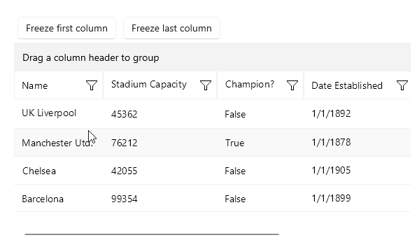
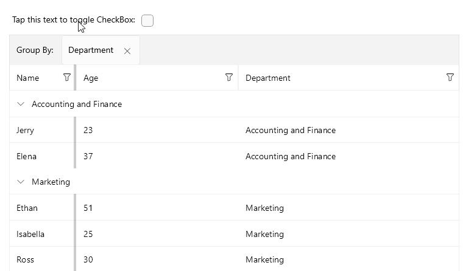
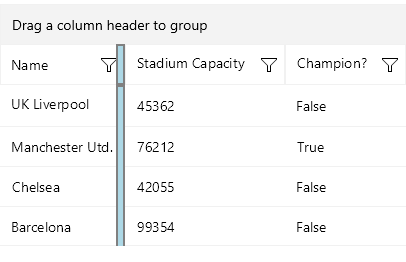

# .NET MAUI DataGrid Frozen Columns

This article describes the frozen columns feature that the [.NET MAUI DataGrid]() provides. 

You can pin a column on the left side of the grid by setting the `IsFrozen`(`bool`) property to the column. By default the value is `False`. When setting it to `True` to a concrete column, it makes the column frozen. 



Set the column freeze in XAML

```XAML
<telerik:RadDataGrid x:Name="grid" 
                     ItemsSource="{Binding Clubs}" 
                     AutoGenerateColumns="False">
    <telerik:RadDataGrid.Columns>
        <telerik:DataGridTextColumn PropertyName="Name" 
                                    IsFrozen="True"
                                    HeaderText="Name"/>
    </telerik:RadDataGrid.Columns>
</telerik:RadDataGrid> 
```

Set the column freeze programmatically.

<snippet id='data-grid-frozen-columns-programmatically' />

## Collection of Frozen Columns

Once a column is frozen, it is added to the `FrozenColumns` collection (read-only collection). The collection can be used only for read-only purposes and cannot be modified. Freezing/Unfreezing the columns is done only through the `IsFrozen` property of the columns.

## Group Header and Frozen Columns

In a scenario with frozen columns and grouping, you can specify whether the group header will be clipped to the bounds of the frozen area by setting the `AreGroupHeadersClippedWhenFrozen` (`bool`) property. The default value is `False`.

Here is the result when the `AreGroupHeadersClippedWhenFrozen` property is set:



## Styling

When there is/are frozen column(s) a splitter UI is visualized. The splitter UI splits the frozen columns from the unfrozen. 

You can style the frozen splitter UI using the `FrozenColumnsSplitterStyle`(`Telerik.Maui.Controls.DataGrid.DataGridFrozenColumnsSplitterStyle`) property. The `FrozenColumnsSplitterStyle` property is a property of the DataGrid. It cannot be set on a specific column.

Style the splitter UI's `Width`, `BackgroundColor`, `BorderColor` and `BorderThickness`. 

**Example for `FrozenColumnsSplitterStyle`**

```XAML
<telerik:RadDataGrid.FrozenColumnsSplitterStyle>
    <telerik:DataGridFrozenColumnsSplitterStyle Width="8"
                                                BorderColor="Gray"
                                                BorderThickness="2"
                                                BackgroundColor="LightBlue"/>
</telerik:RadDataGrid.FrozenColumnsSplitterStyle>
```




## See Also

- [Picker Column]()
- [Template Column]()
- [Text Column]()
