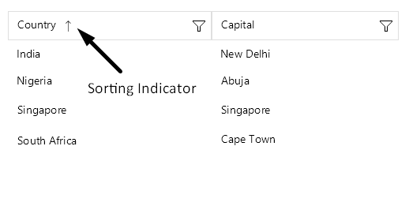
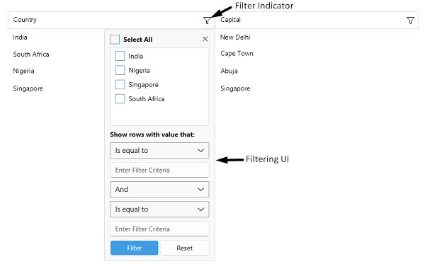
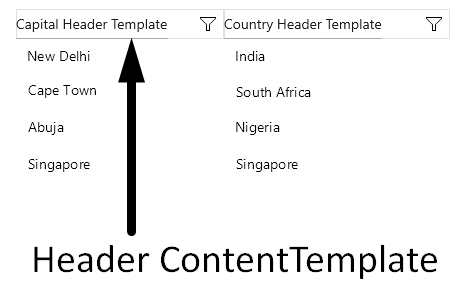
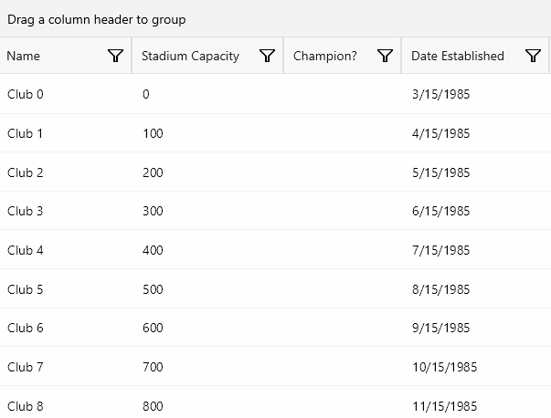

# .NET MAUI DataGrid Column Headers

This article will guide you through the usage of the column headers, their customization as well through performing different data operations. Column headers are always visible by default. You can further customize the headers by using the `HeaderStyle` property.


## Changing the Text in the Header

To customize text inside the header you have to use the `HeaderText` property. The property is per column. If `HeaderText` is not set, the text inside the `PropertyName` is displayed.

```XAML
<telerik:RadDataGrid x:Name="dataGrid" 
					 AutoGenerateColumns="False">
	<telerik:RadDataGrid.Columns>
		<telerik:DataGridTextColumn PropertyName="Capital" 
									HeaderText="Capital Header"/>
		<telerik:DataGridTextColumn PropertyName="Country" 
									HeaderText="Country Header"/>
	</telerik:RadDataGrid.Columns>
</telerik:RadDataGrid>
```

## Sorting

The user of the application can sort a particular column when tapping on its header. When the data is sorted by a column, the sort indicator shows in the header.



To learn more about the sorting functionality take a look at the [Sorting]() article.

## Filtering

The header of the column hosts the built-in filtering mechanism (the filter indicator which opens the Filtering UI), which allows the user to filter the data by the columns' values.



To learn more about the filtering functionality take a look at the [Filtering]() article.

## Styling 

Use the `HeaderStyle` property to style the `DataGridColumn` header.

Check the [.NET MAUI DataGrid Column Header Styling](#headerstyle) topic for more information about the styling options you can use. 

>tip For more details how to hide the column headers from the DataGrid visualization, review the following article: [How to Hide Column Headers in a DataGrid for MAUI]().

## Header Content Customization

You can customize the content of the Header using the `HeaderContentTemplate`(`DataTemplate`) property.

Define the `DataTemplate` for the header:

<snippet id='datagrid-headercontenttemplate-datatemplate' />

Define the `HeaderContentTemplate` in the DataGrid column:

<snippet id='datagrid-headerfootercontenttemplate' />



## Color on Hover

You can change the hover state background color of the column header by setting the `BackgroundColor` property.

The following example demonstrates how to apply the `BackgroundColor` property to the DataGrid `HeaderContentTemplate` for its hover visual state: 

```XAML
  <DataTemplate x:Key="CustomHeaderTemplate">
            <telerik:RadBorder BackgroundColor="#F8F8F8"
                               BorderThickness="1">
                <VisualStateManager.VisualStateGroups>
                    <VisualStateGroup x:Name="CommonStates">
                        <VisualState x:Name="Normal" />
                        <VisualState x:Name="Focused" />
                        <VisualState x:Name="Disabled" />
                        <VisualState x:Name="PointerOver">
                            <VisualState.Setters>
                                <Setter Property="BackgroundColor" Value="#33000000" />
                            </VisualState.Setters>
                        </VisualState>
                    </VisualStateGroup>
                </VisualStateManager.VisualStateGroups>
            </telerik:RadBorder>
    </DataTemplate>
```

This is the result:



## Customize the Column

Customize the column header by using the `HeaderContentTemplate`(of type `DataTemplate`) to achieve the desired full customization of the column. The property demonstrates the ability of the DataGrid to specify and show custom appearance for the column headers.

## See Also

- [Text Column]()
- [Picker Column]()
- [Template Column]()
