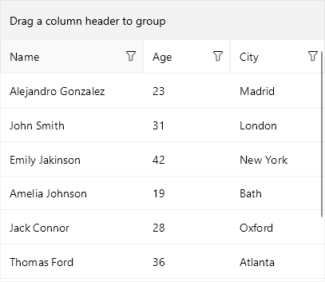

# Nested Properties Support

DataGrid provides support for nested properties - this allows binding of complex objects to the grid columns.

In addition, the DataGrid control provides the following property:  
* `ListenForNestedPropertyChange` *(bool)*: Allows the DataGrid to listen for changes of the nested properties' values. By default it is *false*.

>tip ListenForNestedPropertyChange is false due to optimization purposes, you could enable it in case you'd need to update the nested properties' values.

## Example

Here is an example how you could utilize the nested properties feature in DataGrid:

First, create the needed business objects, for example type `Person` that will have property of type `Address`:

```C#
public class Person : NotifyPropertyChangedBase
{
    private string name;
    private double age;
    private Address address;

    public string Name
    {
        get { return this.name; }
        set { this.UpdateValue(ref this.name, value); }
    }
    public double Age
    {
        get { return this.age; }
        set { this.UpdateValue(ref this.age, value); }
    }
    public Address Address
    {
        get { return this.address; }
        set { this.UpdateValue(ref this.address, value); }
    }
}
```

and Address model

```C#
public class Address : NotifyPropertyChangedBase
{
    private string city;
    private string street;
    public string City
    {
        get { return this.city; }
        set { this.UpdateValue(ref this.city, value); }
    }
    public string Street
    {
        get { return this.street; }
        set { this.UpdateValue(ref this.street, value); }
    }
}
```

In the sample both classes inherit from NotifyPropertyChangedBase class which basically implements the INotifyPropertyChanged interface. You would need to add the following namespace to use it:

```C#
using Telerik.XamarinForms.Common;
```

Then create a ViewModel with a collection of `Person` objects:

```C#
public class ViewModel
{
    public ObservableCollection<Person> Persons { get; set; }

    public ViewModel()
    {
        var source = new ObservableCollection<Person>();

        source.Add(new Person() { Name = "Alejandro Gonzalez ", Age = 23, Address = new Address() { City = "Madrid" } });
        source.Add(new Person() { Name = "John Smith", Age = 31, Address = new Address() { City = "London" } });
        source.Add(new Person() { Name = "Emily Jakinson", Age = 42, Address = new Address() { City = "New York" } });
        source.Add(new Person() { Name = "Amelia Johnson", Age = 19, Address = new Address() { City = "Bath" } });
        source.Add(new Person() { Name = "Jack Connor", Age = 28, Address = new Address() { City = "Oxford" } });
        source.Add(new Person() { Name = "Thomas Ford", Age = 36, Address = new Address() { City = "Atlanta" } });
        source.Add(new Person() { Name = "James Williams", Age = 25, Address = new Address() { City = "Houston" } });
        source.Add(new Person() { Name = "Nikole Smith", Age = 38, Address = new Address() { City = "Chicago" } });

        this.Persons = source;
    }
}
```

Finally, use the following snippet to declare a RadDataGrid in XAML:

```XAML
<telerikDataGrid:RadDataGrid Grid.Row="1" x:Name="grid"
                                         ItemsSource="{Binding Persons}"
                                         AutoGenerateColumns="False"
                                         UserEditMode="Cell">
    <telerikDataGrid:RadDataGrid.Columns>
        <telerikDataGrid:DataGridTextColumn x:Name="nameColumn" PropertyName="Name"/>
        <telerikDataGrid:DataGridNumericalColumn PropertyName="Age"/>
        <telerikDataGrid:DataGridTextColumn PropertyName="Address.City" HeaderText="City"/>
    </telerikDataGrid:RadDataGrid.Columns>
</telerikDataGrid:RadDataGrid>
```

Where the `telerikGrid` namespace is the following:

```xml
xmlns:telerikDataGrid="clr-namespace:Telerik.XamarinForms.DataGrid;assembly=Telerik.Maui.Controls.Compatibility"
```

Here is how tha DataGrid looks:



## See Also

- [Picker Column]()
- [Template Column]()
- [Text Column]()
