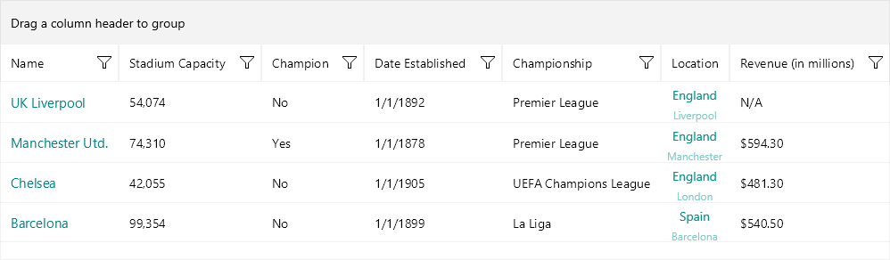

# .NET MAUI DataGrid Defining Columns

The [Telerik UI for .NET MAUI DataGrid]() provides three approaches that you can take to define different columns:

* **Automatically**&mdash;by setting `AutoGenerateColumns` property to `True` (default value).
* **Manually**&mdash;by adding columns to the DataGrid's `Columns` collection and setting the `AutoGenerateColumns` property to `False`.
* **Mixed**&mdash;by adding columns to the `Columns` collection and also setting the `AutoGenerateColumns`to `True` (default value).

## Automatic Columns Generation

By default, the DataGrid will generate typed columns automatically based on the underlying data type. When, for example, you set the `ItemsSource` of the `RadDataGrid` to a collection of clubs (see the sample code below), the control will create a separate column for each public property of the `Club` object.

For example, let's have a sample `Club` object:

```XAML
public class Club
{ 
    public string Name { get; set; }
    public DateTime Established { get; set; }
    public bool IsChampion { get; set; }
}
```

With the automatic columns generation DataGrid will create the following columns:

* `DataGridTextColumn` for the `Name` property.
* `DataGridDateColumn` for the `Established` property.
* `DataGridBooleanColumn` for the `IsChampion` property.

## Manual Columns Definition

Using the built-in auto generation of columns does not fit all scenarios. In such cases you can manually define the needed columns. When defining a column you can choose between several column types:

* [Text Column]()&mdash;Represents a column that converts the content of each associated cell to a System.String object.
* [Numerical Column]()&mdash;Represents an extended `DataGridTextColumn` that presents numerical data (`int` and `double` types).
* [Boolean Column]()&mdash;An extended `DataGridTextColumn` implementation that presents Boolean data.
* [Date Column]()&mdash;An extended `DataGridTextColumn` that presents data of type `DateTime`.
* [Time Column]()&mdash;Represents an extended `DataGridTextColumn` that presents the `TimeOfDay` of a `DateTime` type.
* [ComboBox Column]()&mdash;Represents an extended `DataGridTextColumn`  which cell value editor is a Telerik.Maui.Controls.RadComboBox control.
* [Template Column]()&mdash;Represents a column that uses a `DataTemplate` to describe the content of each associated grid cell.
* [ToggleRowDetails Column]()&mdash;Represents a column that allows the user to show and hide the row details for an item.

For the typed columns (Text, Numerical, Boolean, Date, Time and ComboBox) you can define which property of the underlying data object the column represents in the following ways:

* `PropertyName`&mdash;Specifies the name of the property of the data object being displayed in the column's cells.
* `DataMemberBinding`&mdash;Defines the binding which points to the data member of the underlying object being displayed in the column's cell. With `DataMemberBinding`, you have control over the way data is formatted and displayed in the DataGrid cells, for example you can add a string formatter or a value converter.

The example below demonstrates `RadDataGrid` with various types of columns. In addition both `PropertyName` and `DataMemberBinding` are used for the different columns to set the property each column represents. 

**1.** Use the following snippet to declare a `RadDataGrid` in XAML:

<snippet id='datagrid-columns-example' />

**2.** Where the `telerik` namespace is the following:

```XAML
xmlns:telerik="http://schemas.telerik.com/2022/xaml/maui"
```

**3.** The `ViewModel` class is declared as following:

<snippet id='datagrid-column-view-model' />

**4.** And the namespace used for `NotifyPropertyChangedBase`:

 ```C#
 using Telerik.Maui.Controls
 ```

**5.** And the `Club` custom object:

<snippet id='datagrid-club-model' />

**6.** Add the `BoolToValueConverter` to the page's resources:

<snippet id='datagrid-columns-converter' />

Check the result in the image below:



> For a runnable example with the DataGrid columns, see the [SDKBrowser Demo Application]() and go to the **DataGrid > Columns** category.

## Columns Features

Find below a quick overview of the DataGrid's Columns features.

### Column Headers

The top cell of a column is called Header. Its purpose is to set a caption for the column, which describes the data displayed in it. The .NET MAUI DataGrid provides fully customizable column headers, check [Column Headers]() for detailed information.

### Columns Cell Templates

The DataGrid provides a set of predefined column types such as Text Column, Numerical Column, etc. In case you need to extend the functionality of a column, for example customize the default appearance or add more UI elements, use the exposed templates - `CellContentTemplate` and `CellEditTemplate`. For detailed information, see the [Columns Cells Templates]() topic.

### Column Footers

The DataGrid allows you to display additional information which applies to the columns in a specific row placed at the bottom of the control. This row consists of individual footer cells for each column. Take a look at the [Column Footers]() for detailed information.

### Column Resizing

Columns inside the Telerik .NET MAUI DataGrid are resizable by default. The feature is available only on Desktop - WinUI and MacCatalyst. For more details see the [Column Resizing]() topic.

### Columns Width

The DataGrid provides a flexible mechanism for setting columns' width through columns' `SizeMode` and `Width` properties. For more details see the [Columns Width]() topic.

### Frozen Columns

You can pin a column on the left side of the DataGrid by setting the `IsFrozen` property to the column. By default the value is `False`. When setting it to `True` to a concrete column, it makes the column frozen. For detailed information, see the [Frozen Columns]() topic.

### Columns Reordering

The DataGrid exposes a reordering feature allowing the user to drag and drop columns and change their order. For more details, see the [Columns Reordering]() topic.

>tip For an outline of all DataGrid features review the [.NET MAUI DataGrid Overview]() article.

## See Also

- [Column Headers]()
- [Columns Cells Templates]()
- [Column Footers]()
- [Column Resizing]()
- [Columns Width]()
- [Frozen Columns]()
- [Columns Reordering]()
