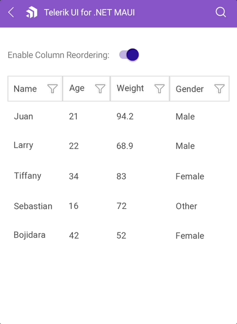

# .NET MAUI DataGrid Column Reordering

The DataGrid exposes a reordering feature allowing the user to drag and drop columns and change their order.


## Properties

`CanUserReorderColumns`(`bool`)&mdash;Defines whether the user can reorder the `DataGridColumns`. The default value is `True`.
`ColumnReorderIndicatorTemplate`(`DataTemplate`)&mdash;Defines the template that presents the indicator which is shown between two columns during reordering.

## Example

**Example with Reorder Columns**

The following example shows how to bind the `CanUserReorderColumns` using MVVM.

Define the DataGrid and a control which will change the `CanUserReorderColumns` value in XAML:

<snippet id='datagrid-reordering-example'/>

Define the ViewModel:

<snippet id='datagrid-reordering-viewmodel'/>

The result on mobile:



**Example with indicator template applied when reordering columns**

The following example shows how to define the `ColumnReorderIndicatorTemplate` in XAML:

Define the DataTemplate for the Indicator in the Resources of the page:
```XAML
<DataTemplate x:Key="reorderingIndicator">
    <telerik:RadBorder BackgroundColor="LightSalmon"
                       WidthRequest="4"
                       HeightRequest="55"
                       HorizontalOptions="Start"
                       VerticalOptions="Start"
                       InputTransparent="True" />
</DataTemplate>
```

Define the property in the DataGrid:
```XAML
<telerik:RadDataGrid x:Name="dataGrid"
                     Grid.Row="1"
                     ColumnReorderIndicatorTemplate="{StaticResource reorderingIndicator}"
                     ItemsSource="{Binding Data}"/>    
```

The result on mobile:


## See Also

- [Picker Column]()
- [Template Column]()
- [Text Column]()