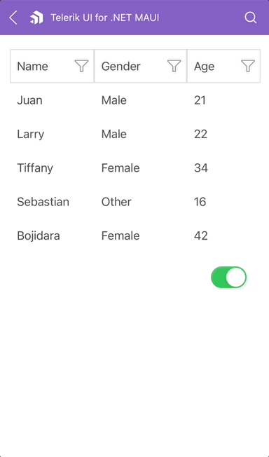

# .NET MAUI DataGrid Reordering

The DataGrid exposes a reordering feature allowing the user to drag and drop a columns and change their order.

## Properties

`CanUserReorderColumns`(`bool`)&mdash;Defines whether the user can reorder the `DataGridColumns`. The default value is `True`.

## Example

The following example shows how to bind the `CanUserReorderColumns` using MVVM.

Define the DataGrid and a control which will change the `CanUserReorderColumns` value in XAML:

<snippet id='datagrid-reordering-example'/>

Define the ViewModel:

<snippet id='datagrid-reordering-viewmodel'/>

The result looks as follows:

## See Also

- [Picker Column]()
- [Template Column]()
- [Text Column]()